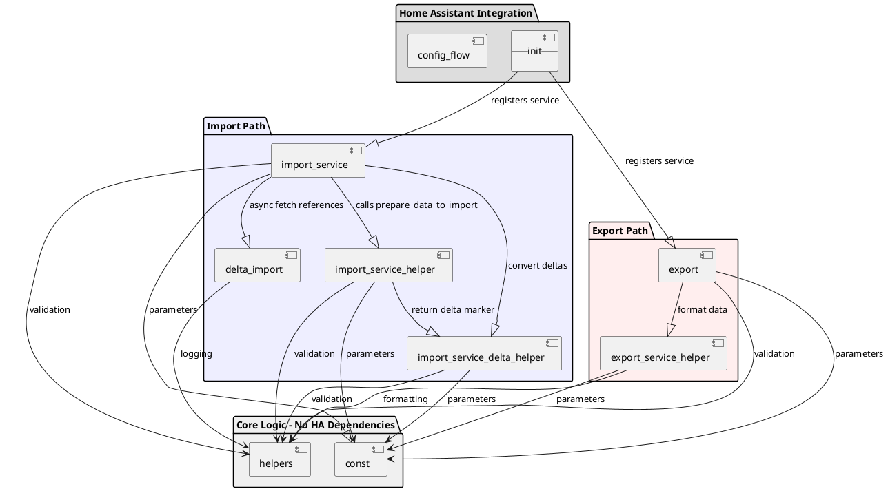
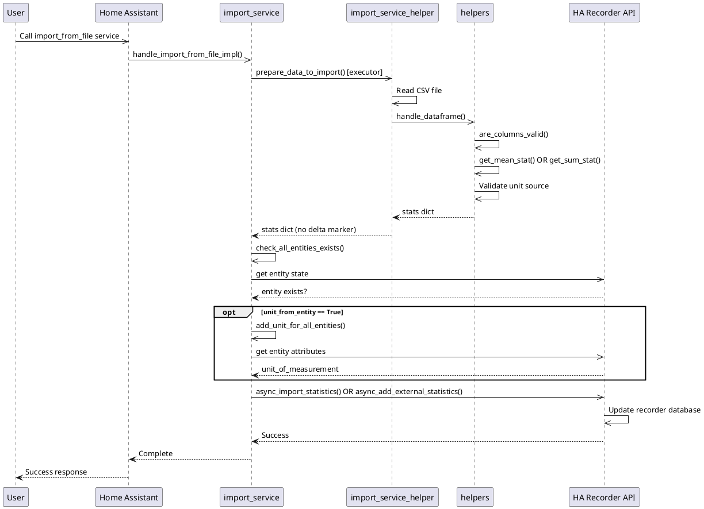
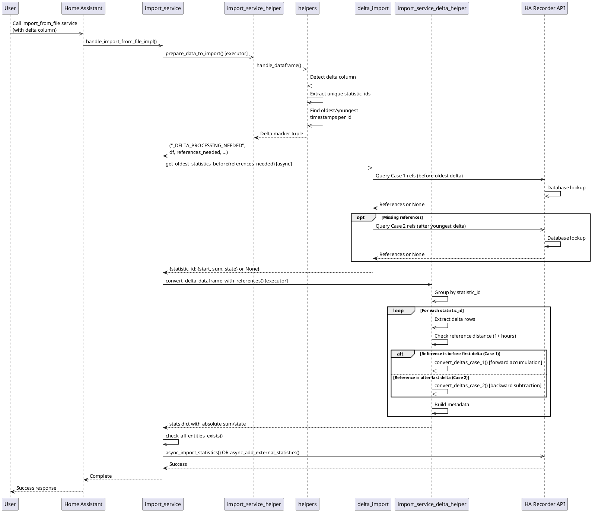
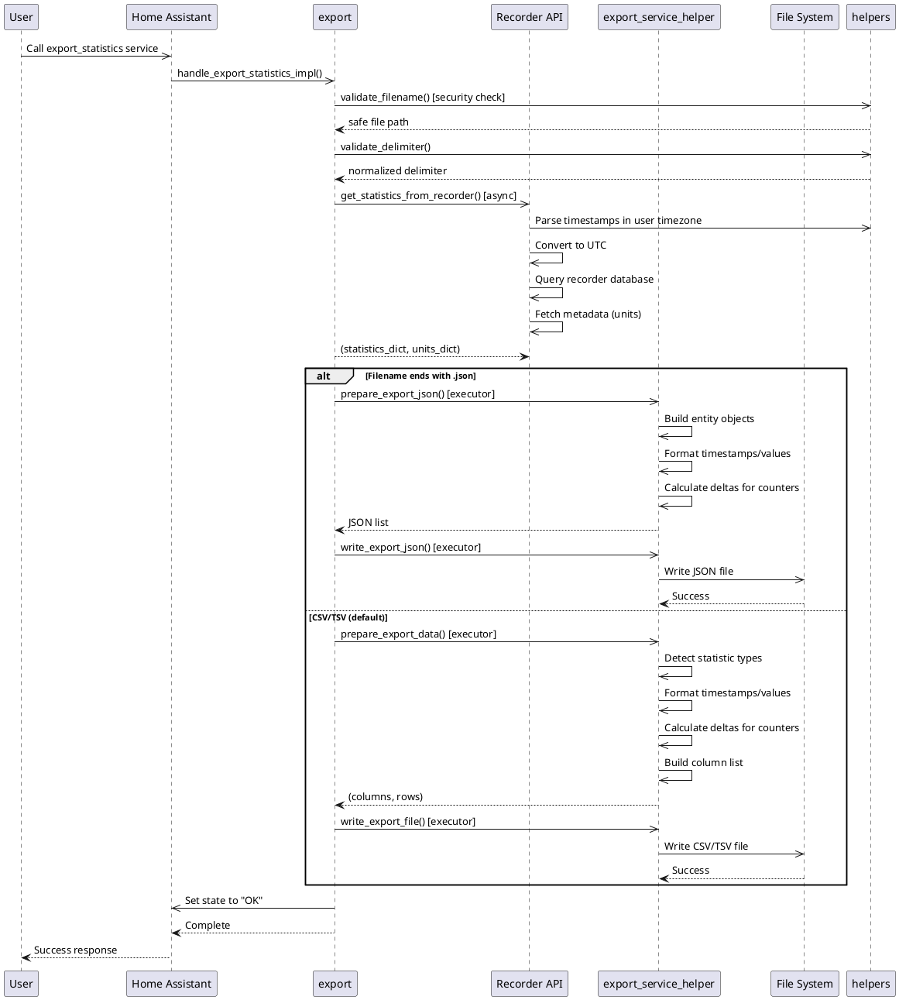
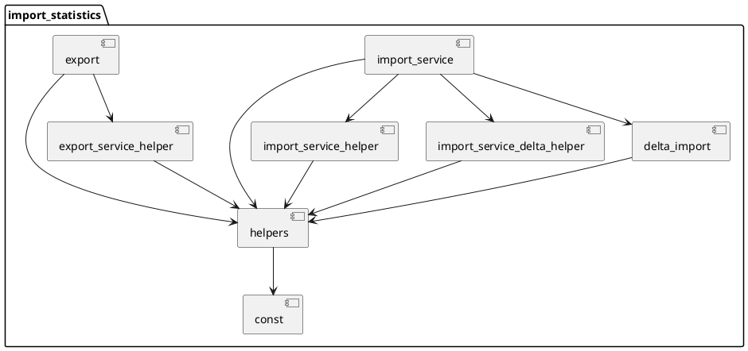

# Architecture Description: Home Assistant Statistics Import/Export Integration

## Overview

The `import_statistics` integration provides functionality to import and export Home Assistant long-term statistics from/to CSV, TSV, and JSON files. It handles two types of statistics:

- **Internal Statistics** (recorder source): Uses entity format `sensor.name`, sources from existing Home Assistant entities
- **External Statistics** (custom source): Uses format `domain:name`, creates new synthetic statistics

The architecture features dual import paths (delta and normal), delta conversion with database reference lookups, and flexible export formatting.

---

## Component Description

### [`__init__.py`](custom_components/import_statistics/__init__.py)
**Purpose**: Integration entry point and service registration.

**Methods**:
- [`setup(hass, config)`]: Registers three services with Home Assistant:
  - `import_from_file`: Service to import statistics from CSV/TSV files
  - `import_from_json`: Service to import statistics from JSON data
  - `export_statistics`: Service to export statistics to files
  - Returns `True` on successful initialization

- [`async_setup_entry(hass, entry)`]: Empty config entry handler (not used)

**Key Pattern**: Synchronous `setup()` registers async service handlers, allowing Home Assistant to call services synchronously while handlers execute asynchronously internally.

---

### [`helpers.py`](custom_components/import_statistics/helpers.py)
**Purpose**: Core validation, conversion, and utility functions. No Home Assistant dependencies except for error handling and validators.

**Classes**:
- [`UnitFrom` Enum]: Two-state enum (TABLE, ENTITY) determining unit source validity
  - TABLE: Unit extracted from CSV/JSON file
  - ENTITY: Unit extracted from Home Assistant entity attributes

**Key Methods**:
- [`get_source(statistic_id)`]: Validates statistic_id format and returns source type ("recorder" or domain name)
  - Accepts: `sensor.name` (internal) or `domain:name` (external)
  - Rejects: "recorder" domain in any format

- [`are_columns_valid(df, unit_from_where)`]: Validates DataFrame structure
  - Checks required columns: `statistic_id`, `start`, and conditionally `unit`
  - Validates value columns: must have EITHER (mean, min, max) OR (sum, state) OR (delta), never mixed
  - Rejects unknown columns

- [`get_mean_stat(row, timezone, datetime_format)`]: Extracts and validates mean/min/max statistics from a row
  - Validates timestamp is full hour
  - Validates min ≤ mean ≤ max
  - Returns dict with start (timezone-aware datetime) and values

- [`get_sum_stat(row, timezone, datetime_format)`]: Extracts and validates sum/state statistics
  - Handles optional state column
  - Returns dict with start and values

- [`get_delta_stat(row, timezone, datetime_format)`]: Extracts delta value from row (silent failure pattern)
  - Returns empty dict on validation failure
  - Used for delta column processing

- [`min_max_mean_are_valid(min, max, mean)`]: Constraint validation
  - Returns True if min ≤ mean ≤ max
  - Raises HomeAssistantError otherwise

- [`is_full_hour(timestamp_str, datetime_format)`]: Validates timestamp is at full hour (minutes=0, seconds=0)

- [`is_valid_float(value)`]: Validates string can be converted to float

- [`add_unit_to_dataframe(source, unit_from_where, unit_from_row, statistic_id)`]: Unit selection logic
  - For recorder source + ENTITY mode: return empty (fetch from entity)
  - For external source + ENTITY mode: reject (raises error)
  - For TABLE mode: return unit from file or reject if missing

- [`validate_delimiter(delimiter)`]: Normalizes delimiter string
  - None → "\t"
  - "\\t" → "\t"
  - Single character → unchanged
  - Multi-character → raises error

- [`validate_filename(filename, config_dir)`]: Security validation for export filenames
  - Rejects absolute paths, ".." traversal, and paths outside config_dir
  - Returns validated full file path

- [`format_datetime(dt_obj, timezone, format_str)`]: Formats datetime to string in target timezone
  - Handles Unix timestamps and datetime objects
  - Converts to target timezone for output

- [`format_decimal(value, use_comma)`]: Formats numeric values with optional comma decimal separator

- [`handle_error(error_string)`]: Centralized error handling
  - Logs warning AND raises HomeAssistantError
  - Used throughout for consistent error behavior

---

### [`const.py`](custom_components/import_statistics/const.py)
**Purpose**: Constants and default configuration values.

**Key Constants**:
- `DOMAIN`: "import_statistics"
- `ATTR_*`: Service parameter names (FILENAME, TIMEZONE_IDENTIFIER, DELIMITER, etc.)
- `DATETIME_DEFAULT_FORMAT`: "%d.%m.%Y %H:%M" (dd.mm.yyyy hh:mm)
- `DATETIME_INPUT_FORMAT`: "%Y-%m-%d %H:%M:%S" (for export start/end time parsing)

---

### [`import_service.py`](custom_components/import_statistics/import_service.py)
**Purpose**: Service handlers for file and JSON import, with delta processing detection and dispatch.

**Async Methods**:
- [`handle_import_from_file_impl(hass, call)`]: Main file import handler
  - Extracts filename from service call
  - Calls `prepare_data_to_import()` via executor (blocking I/O)
  - Detects delta marker tuple `("_DELTA_PROCESSING_NEEDED", ...)`
  - Calls `get_oldest_statistics_before()` for async database lookup
  - Calls `convert_delta_dataframe_with_references()` via executor
  - Dispatches to `import_stats()` for final Home Assistant import

- [`handle_import_from_json_impl(hass, call)`]: JSON import handler
  - Same pattern as file import but calls `prepare_json_data_to_import()`

**Sync Methods**:
- [`import_stats(hass, stats, unit_from_entity)`]: Home Assistant integration layer
  - Validates all entities exist (for recorder source)
  - Optionally adds units from entity attributes
  - Calls HA's `async_import_statistics()` or `async_add_external_statistics()`

- [`check_all_entities_exists(hass, stats)`]: Validates entity existence for recorder sources

- [`check_entity_exists(hass, entity_id)`]: Single entity existence check

- [`add_unit_for_all_entities(hass, stats)`]: Fetches units from entity attributes

- [`add_unit_for_entity(hass, metadata)`]: Extracts unit from entity and updates metadata

---

### [`import_service_helper.py`](custom_components/import_statistics/import_service_helper.py)
**Purpose**: Data loading and DataFrame processing for import (non-delta path).

**Methods**:
- [`prepare_data_to_import(file_path, call, hass)`]: Loads and processes CSV/TSV file
  - Parses delimiter, decimal, timezone, datetime format from service call
  - Reads CSV into DataFrame
  - Calls `handle_dataframe()` for processing
  - Returns stats dict or delta marker tuple

- [`prepare_json_data_to_import(call, hass)`]: Processes JSON import data
  - Extracts entities list from service call
  - Constructs DataFrame from JSON structure
  - Calls `handle_dataframe()` for processing

- [`handle_arguments(call)`]: Extracts and validates service call parameters
  - Returns: (decimal_sep, timezone_id, delimiter, datetime_format, unit_from_where)
  - Validates timezone against pytz.all_timezones

- [`handle_dataframe(df, timezone_id, datetime_format, unit_from_where, hass)`]: Core DataFrame processing
  - Validates columns with `are_columns_valid()`
  - **Delta path**: Detects delta column, extracts statistic_ids with oldest/youngest timestamps
    - Returns marker tuple: `("_DELTA_PROCESSING_NEEDED", df, references_needed, timezone_id, datetime_format, unit_from_where)`
    - Marker is async-processed in service handler
  - **Non-delta path**: Iterates rows, extracting mean or sum statistics
    - Builds metadata and statistics list per statistic_id
    - Returns stats dict ready for import

---

### [`import_service_delta_helper.py`](custom_components/import_statistics/import_service_delta_helper.py)
**Purpose**: Pure calculation functions for delta-to-absolute conversion.

**Key Methods**:
- [`convert_deltas_case_1(delta_rows, sum_oldest, state_oldest)`]: Forward accumulation
  - Takes oldest reference value and accumulates deltas forward
  - Returns list of dicts with absolute sum/state values
  - Case 1: Reference exists at least 1 hour BEFORE first delta

- [`convert_deltas_case_2(delta_rows, sum_reference, state_reference)`]: Backward subtraction
  - Takes younger reference value and subtracts deltas backward
  - Processes in reverse order, then reverses result
  - Returns list of dicts with absolute sum/state values in ascending order
  - Case 2: Reference exists at least 1 hour AFTER last delta

- [`convert_delta_dataframe_with_references(df, references, timezone_id, datetime_format, unit_from_where, case_2_enabled)`]: Main conversion orchestrator
  - Groups DataFrame by statistic_id
  - For each group:
    - Extracts delta rows using `get_delta_stat()`
    - Validates reference exists and is 1+ hour away
    - Selects Case 1 or Case 2 based on reference timestamp position
    - Calls appropriate conversion function
  - Builds metadata and returns stats dict
  - Pure calculation: all references pre-fetched, no HA dependency

- [`get_delta_from_stats(rows, decimal_comma)`]: Reverse operation for export
  - Calculates delta from consecutive sum values
  - Sorts by statistic_id then timestamp
  - First record per statistic_id has empty delta

---

### [`delta_import.py`](custom_components/import_statistics/delta_import.py)
**Purpose**: Async database query functions for delta reference lookups.

**Async Methods**:
- [`get_oldest_statistics_before(hass, references_needed)`]: Two-pass reference lookup
  - **Pass 1**: For each statistic_id, queries database for records before its oldest delta timestamp (Case 1)
  - **Pass 2**: For missing references, queries for records after youngest delta (Case 2)
  - Returns dict: `{statistic_id: {start, sum, state} or None}`
  - Validates found references are at least 1 hour away from import timestamps

- [`get_youngest_statistic_after(hass, statistic_id, timestamp)`]: Queries for newer reference
  - Fetches most recent statistic for given statistic_id
  - Validates it's at least 1 hour after the given timestamp
  - Returns dict with start, sum, state or None

**Helper Functions** (sync, run via executor):
- [`_get_reference_stats(metadata_id, timestamp, instance)`]: Low-level database query
  - Uses `_statistics_at_time()` to fetch statistics at specific time
  - Returns raw database row or None

- [`_extract_row_start_datetime(row)`]: Extracts start timestamp from database row
  - Handles both attribute and dict-like access

- [`_get_row_sum_value(row)`]: Extracts sum value from database row

- [`_get_row_state_value(row)`]: Extracts state value from database row

- [`_process_reference_row(statistic_id, row, before_timestamp, result)`]: Validates and stores reference
  - Checks record is strictly before target timestamp
  - Updates result dict

---

### [`export.py`](custom_components/import_statistics/export.py)
**Purpose**: Service handler and recorder API interaction for export.

**Async Methods**:
- [`handle_export_statistics_impl(hass, call)`]: Main export service handler
  - Extracts parameters from service call
  - Validates filename (security check)
  - Validates delimiter
  - Calls `get_statistics_from_recorder()` to fetch data
  - Detects JSON vs CSV/TSV format
  - Calls appropriate prepare and write functions via executor
  - Sets final state to "OK"

- [`get_statistics_from_recorder(hass, entities, start_time_str, end_time_str, timezone_id)`]: Recorder API wrapper
  - Parses start/end times in user's timezone
  - Converts to UTC for recorder query
  - Fetches statistics for full hours
  - Fetches metadata to extract units
  - Returns: (statistics_dict, units_dict)
  - Times in returned data are Unix timestamps (float) in UTC

---

### [`export_service_helper.py`](custom_components/import_statistics/export_service_helper.py)
**Purpose**: Data formatting and file writing for export (CSV/TSV and JSON).

**Methods**:
- [`prepare_export_data(stats_dict, timezone_id, datetime_format, decimal_comma, units_dict)`]: CSV/TSV formatting
  - Detects statistic types (sensor vs counter)
  - Sorts records chronologically
  - Formats timestamps and numeric values
  - Calculates delta for counters
  - Returns: (column_list, rows_as_tuples)
  - Columns determined dynamically based on data types

- [`prepare_export_json(stats_dict, timezone_id, datetime_format, units_dict)`]: JSON formatting
  - Builds entity objects with values array
  - Includes calculated delta for counters
  - Returns list of entity objects

- [`write_export_file(file_path, columns, rows, delimiter)`]: CSV/TSV file output
  - Uses csv module with specified delimiter
  - Creates parent directories if needed

- [`write_export_json(file_path, json_data)`]: JSON file output
  - Writes formatted JSON with 2-space indentation

**Helper Functions**:
- [`_detect_statistic_type(stats_list)`]: Determines if data is sensor (mean/min/max) or counter (sum/state)

- [`_process_statistic_record(stat_record, statistic_id, unit, format_context, all_columns)`]: Converts single record to row dict
  - Formats timestamps and numeric values
  - Handles sparse columns (empty for non-applicable types)

- [`get_delta_from_stats(rows, decimal_comma)`]: Same as in delta_helper, calculates delta from consecutive sums

---

### [`config_flow.py`](custom_components/import_statistics/config_flow.py)
**Purpose**: Configuration flow handling (minimal, uses empty config schema).

---

## Architecture Diagram



---

## Data Flow Diagrams

### Normal Import Flow (without Delta)



### Delta Import Flow



### Export Flow



---

## Key Architectural Patterns

### 1. Dual-Mode Statistics System

Two mutually exclusive types with different validation and source rules:

| Aspect | Internal (recorder) | External (custom) |
|--------|-------------------|-------------------|
| Format | `sensor.name` (dot separator) | `domain:name` (colon separator) |
| Source | Existing HA entity | New synthetic entity |
| Unit Source | Flexible (entity or CSV) | Must be from CSV (TABLE) |
| Validation | Entity must exist in HA | Domain cannot be "recorder" |
| HA API | `async_import_statistics()` | `async_add_external_statistics()` |

### 2. Validation Pipeline

Distributed across multiple stages rather than centralized:

1. **Pre-processing**: File path security, delimiter normalization
2. **Column-level**: `are_columns_valid()` checks structure and column requirements
3. **Row-level**: Individual extraction functions validate values (silent failure on error)
4. **Constraint-level**: Relationship validation (min ≤ mean ≤ max, timestamp full hour)

### 3. Delta Processing Architecture

Three-stage async pipeline with reference lookups:

```
CSV with delta column
  ↓
[Stage 1] prepare_data_to_import() [sync via executor]
  - Detect delta column
  - Extract statistic_ids with oldest/youngest timestamps
  - Return marker tuple
  ↓
[Stage 2] get_oldest_statistics_before() [async]
  - Query database for Case 1 references (1+ hour before)
  - Query database for Case 2 references (1+ hour after) if Case 1 missing
  - Return pre-fetched references
  ↓
[Stage 3] convert_delta_dataframe_with_references() [sync via executor]
  - Pure calculation: no HA dependency
  - Detect Case 1 vs Case 2 from reference timestamp
  - Convert deltas to absolute values via accumulation or subtraction
  - Build metadata and statistics list
```

### 4. Async/Sync Hybrid Pattern

- Service handlers are async (required by HA)
- Data preparation (CSV/JSON parsing) runs sync via executor (avoids blocking)
- Database queries run async (native async support in HA)
- Pure calculations run sync via executor (testable independently)

### 5. Error Handling

Centralized via [`handle_error()`](custom_components/import_statistics/helpers.py:282):
- Always logs warning
- Always raises HomeAssistantError
- Ensures consistent error behavior across all functions

### 6. Timezone Conversion (Bidirectional)

**Import**: User's timezone → UTC
- User provides timestamps in local timezone
- Parsed with `zoneinfo.ZoneInfo(timezone_id)`
- Converted to UTC for internal storage: `.astimezone(dt.UTC)`

**Export**: UTC → User's timezone
- Recorder stores all times in UTC
- Converted to user's timezone for display: `.astimezone(tz)`
- Formatted using user's datetime format preference

### 7. File Path Security

Defense-in-depth for export filenames:
1. Reject absolute paths (start with `/`)
2. Reject `..` directory traversal sequences
3. Resolve final path using `Path.resolve()`
4. Verify within config_dir using `Path.relative_to()`

---

## Data Structures

### Statistics Dictionary Structure

```python
{
    "sensor.temperature": (
        {
            "source": "recorder",
            "statistic_id": "sensor.temperature",
            "mean_type": StatisticMeanType.ARITHMETIC,
            "has_sum": False,
            "unit_of_measurement": "°C",
            "name": None,
            "unit_class": None,
        },
        [
            {
                "start": datetime(...),  # timezone-aware
                "min": 15.2,
                "max": 22.5,
                "mean": 18.7,
            },
            # ... more records
        ]
    ),
    "power:total": (
        {
            "source": "power",
            "statistic_id": "power:total",
            "mean_type": StatisticMeanType.NONE,
            "has_sum": True,
            "unit_of_measurement": "kWh",
            "name": None,
            "unit_class": None,
        },
        [
            {
                "start": datetime(...),  # timezone-aware
                "sum": 1234.56,
                "state": 1234.56,
            },
            # ... more records
        ]
    ),
}
```

### References Dictionary (for Delta Import)

```python
{
    "sensor.energy": {
        "start": datetime(...),  # datetime of reference record
        "sum": 5432.1,          # sum value at reference time
        "state": 5432.1,        # state value at reference time
    },
    "power:total": None,  # No reference found (error case)
}
```

### Delta Marker Tuple

```python
(
    "_DELTA_PROCESSING_NEEDED",  # Marker string
    df,                          # DataFrame with delta column
    {                            # references_needed dict
        "sensor.energy": (oldest_dt_utc, youngest_dt_utc),
        "power:total": (oldest_dt_utc, youngest_dt_utc),
    },
    "Europe/Vienna",             # timezone_identifier
    "%d.%m.%Y %H:%M",           # datetime_format
    UnitFrom.TABLE,             # unit_from_where
)
```

---

## Module Dependencies



---

## Testing Strategy

The architecture supports multiple test levels:

1. **Unit Tests** (`tests/unit_tests/`):
   - Test pure functions in `helpers.py`, `import_service_delta_helper.py`
   - No Home Assistant mocks required
   - Fast execution

2. **Integration Tests with Mocks** (`tests/integration_tests_mock/`):
   - Test service handlers with mocked Home Assistant
   - Uses `pytest-homeassistant-custom-component`
   - Tests delta detection and conversion flow

3. **Integration Tests with Real HA** (`tests/integration_tests/`):
   - Tests against running Home Assistant instance
   - Requires HA_TOKEN_DEV environment variable
   - Validates full import/export workflow with actual database

---

## Error Handling Strategy

All validation errors use [`handle_error()`](custom_components/import_statistics/helpers.py:282):

```python
# Pattern used throughout codebase:
if validation_failed:
    handle_error(f"Descriptive error message: {details}")
```

This ensures:
- Consistent logging (warning level)
- Consistent exception type (HomeAssistantError)
- Visible to Home Assistant logs
- Prevents silent failures

Silent failures occur only at row-level during extraction:
- `get_delta_stat()` returns empty dict on validation failure
- Invalid rows are skipped (not imported)
- Logged as debug or warning, continues processing

---

## Performance Considerations

1. **CSV Parsing**: Uses pandas with specified delimiter and decimal separator
2. **Database Queries**: Uses Home Assistant recorder executor for async I/O
3. **DataFrame Operations**: In-memory processing, sorted once for export
4. **Delta Conversion**: Two-pass reference lookup (Case 1 then Case 2) with minimal queries
5. **File I/O**: Done via executor to avoid blocking event loop

---

## Known Limitations & Design Decisions

1. **No Transaction Rollback**: Partial imports succeed if some rows validate
2. **Row-Level Silent Failures**: Invalid rows skipped, not reported individually
3. **Data Format Asymmetry**: Export allows mixed sensor/counter data, import requires separation
4. **Timezone Validation**: Must be valid in both directions (checked against pytz.all_timezones)
5. **Full-Hour Timestamps**: All timestamps must be at exact hour boundary (minutes=0, seconds=0)
