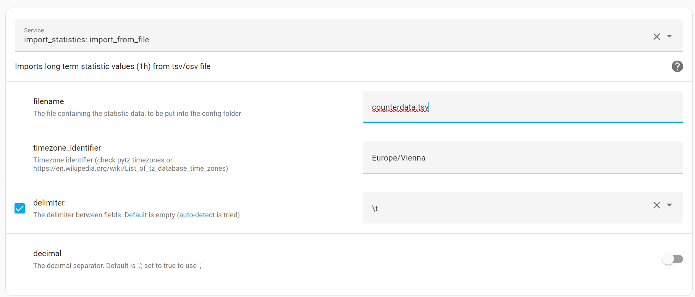

# Import statistics

This HA integration allows to import long term statistics from a file like csv or tsv.

[![GitHub Release][releases-shield]][releases]
[![GitHub Activity][commits-shield]][commits]
[![License][license-shield]](LICENSE)

<!-- ![Project Maintenance][maintenance-shield] -->

[![Community Forum][forum-shield]][forum]

**This integration just offers a service**

## Installation

### HACS

The preferred way is to use HACS:

1. Add this repository as custom repository under HACS
1. Add `import_statistics:` to your configuration .yaml (if it is possible to do this in the UI in some way without directly editing the yaml file, please let me know)
1. Restart home assistant

### Manual installation

1. Using the tool of choice open the directory (folder) for your HA configuration (where you find `configuration.yaml`).
1. If you do not have a `custom_components` directory (folder) there, you need to create it.
1. In the `custom_components` directory (folder) create a new folder called `homeassistant-statistics`.
1. Download _all_ the files from the `custom_components/homeassistant-statistics/` directory (folder) in this repository.
1. Place the files you downloaded in the new directory (folder) you created.
1. Add `import_statistics:` to your configuration .yaml (if it is possible to do this in the UI in some way without directly editing the yaml file, please let me know)
1. Restart Home Assistant

## Usage

This integration offers the service `import_from_file` to import statistics from a file.

First, create your file. The structure is different for statistics with min/max/mean and counter statistics with state/sum.

Here you can find example files for both.

- [min/max/mean](./assets/min_max_mean.tsv)
- [Counters (state/sum)](./assets/state_sum.tsv)

The examples are hopefully self-explaining, just some additional information:

- You can use different settings for the delimiter (default is tab (tsv))
- For floats, the decimal separator can be '.' or ','
- You should be able to find your timezone [here](https://en.wikipedia.org/wiki/List_of_tz_database_time_zones), or check the python documentation (pytz). Keep in mind that the times are local times of the HA server.

Then, copy your file to your HA configuration (where you find `configuration.yaml`).

Then, go to `Developer tools / Services`, and select the service `import_statistics: import_from_file`.

Fill out the settings in the UI:



or use the yaml syntax:

```yaml
service: import_statistics.import_from_file
data:
  timezone_identifier: Europe/Vienna
  delimiter: \t
  decimal: false
  filename: counterdata.tsv
```

Last, call the service. You will get feedback directly in the GUI.

> The importing is an async operation. Depending on the size of the import, it can take some time until the import is finished, even though you already get an OK as feedback in the GUI

> It is also possible that importing does not work, and you do not get an error directly in the GUI. This can happen if only the recorder throws errors, e.g. when the numbers are formatted wrongly (this is not checked in the integration). In this case, check the HA logs.

## Contributions are welcome!

If you want to contribute to this please read the [Contribution guidelines](CONTRIBUTING.md)

***

[import_statistics]: https://github.com/klausj1/homeassistant-statistics
[commits-shield]: https://img.shields.io/github/commit-activity/y/klausj1/homeassistant-statistics.svg
[commits]: https://github.com/klausj1/homeassistant-statistics/commits/main
[exampleimg]: example.png
[forum-shield]: https://img.shields.io/badge/community-forum-brightgreen.svg
[forum]: https://community.home-assistant.io/
[license-shield]: https://img.shields.io/github/license/klausj1/homeassistant-statistics.svg
[releases-shield]: https://img.shields.io/github/v/release/klausj1/homeassistant-statistics?include_prereleases
[releases]: https://github.com/klausj1/homeassistant-statistics/releases

