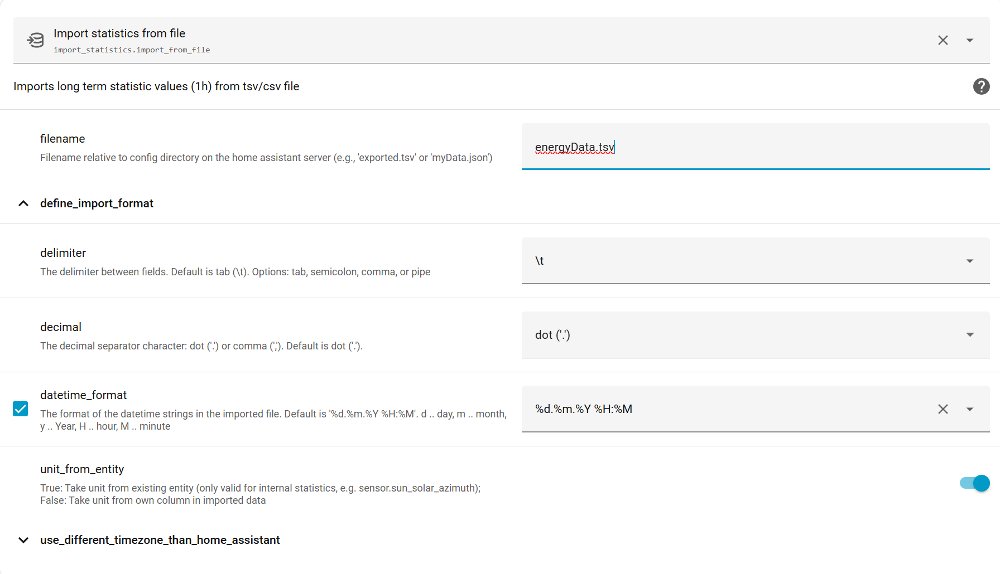
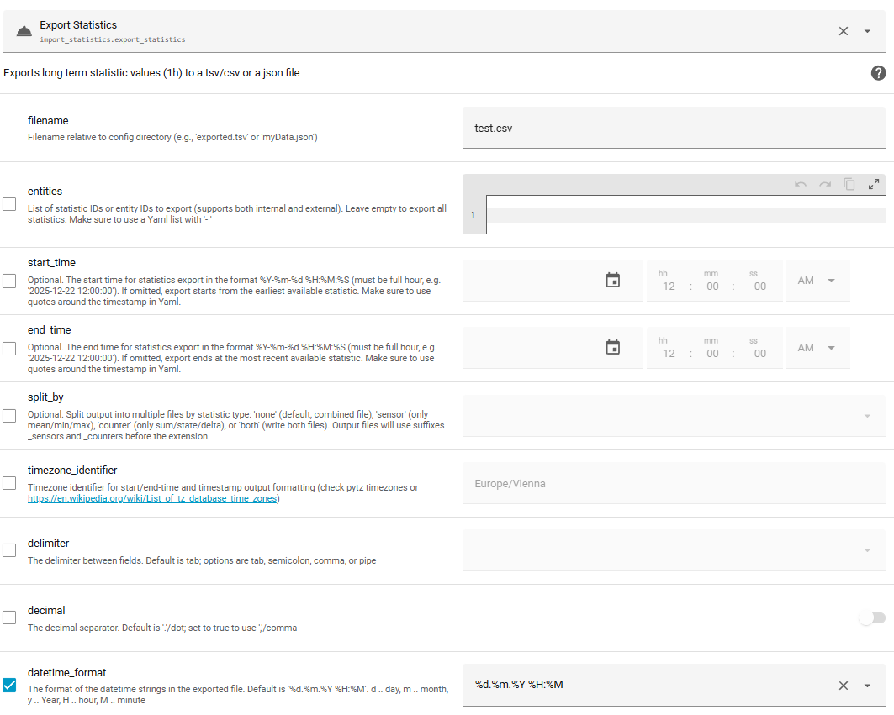

# Import Statistics

A Home Assistant custom integration to import and export long-term statistics from CSV, TSV, or JSON files.

[![GitHub Release][releases-shield]][releases]
[![GitHub Activity][commits-shield]][commits]
[![License][license-shield]](LICENSE)
[![Community Forum][forum-shield]][forum]

> **Note:** This integration provides actions only (no entities or dashboard cards). You call its actions from Developer Tools or automations.

## Quick Links

- [Installation](#installation) | [Importing](#importing-statistics) | [Exporting](#exporting-statistics) | [Troubleshooting](#troubleshooting)
- [Counter Statistics Explained](./docs/user/counters.md#understanding-counter-statistics-sumstate) | [Delta Import](./docs/user/counters.md#delta-import)

This is the user guide. If you are a developer, check the [Developer Documentation](./docs/dev/README.md).

## Requirements

- Home Assistant 2026.1.0 or newer

## Installation

### Option 1: HACS (Recommended)

1. Install via HACS, or click: [![Open HACS Repository][hacs-repo-badge]][hacs-repo]
2. Restart Home Assistant
3. Add the integration: [![Add Integration][config-flow-badge]][config-flow]

### Option 2: Manual

1. Download all files from `custom_components/import_statistics/` in this repository
2. Copy them to `<config>/custom_components/import_statistics/` (create folders if needed)
3. Add `import_statistics:` to your `configuration.yaml`
4. Restart Home Assistant

## Available Actions


| Action                                | Description                             |
| --------------------------------------- | ----------------------------------------- |
| `import_statistics.import_from_file`  | Import statistics from a CSV/TSV file   |
| `import_statistics.import_from_json`  | Import statistics from JSON (UI or API) |
| `import_statistics.export_statistics` | Export statistics to CSV/TSV or JSON    |

> As this integration uses database-independent methods, it works with all databases supported by Home Assistant.

---

## Importing Statistics

### Step 1: Prepare Your File

Your file must contain one type of statistics:

- **Sensors (state_class == measurement)** (temperature, humidity, etc.): columns `min`, `max`, `mean`
- **Counters (state_class == increasing or total_increasing)** (energy, water meters, etc.): columns `sum`, `state` (or `delta`)

> **Before importing counters, make sure to read** [Understanding counter statistics in Home Assistant](./docs/user/counters.md)
> For importing counters, it is **recommended to use the import with the delta column** instead of importing sum/state, see [Delta Import](./docs/user/counters.md#delta-import)

Example files:

- [Sensors (min/max/mean)](./assets/min_max_mean.tsv)
- [Counters (sum/state)](./assets/state_sum.tsv)
- [Counters (delta)](./assets/delta.tsv)

### Step 2: File Format Requirements


| Requirement              | Details                                                                                                                                                |
| -------------------------- | -------------------------------------------------------------------------------------------------------------------------------------------------------- |
| **Timestamp format**     | `DD.MM.YYYY HH:MM` (e.g., `17.03.2024 02:00`) (other formats are also possible)                                                                        |
| **Timestamp constraint** | Minutes must be`:00` (full hours only)                                                                                                                 |
| **Timezone**             | Timestamps are interpreted as local time; find yours at[Wikipedia](https://en.wikipedia.org/wiki/List_of_tz_database_time_zones) (e.g., Europe/Vienna) |
| **File encoding**        | UTF-8 (required for special characters like m³ or °C)                                                                                                |
| **Delimiter**            | Tab (default), comma, semicolon, or pipe                                                                                                               |
| **Decimal separator**    | `.` (default) or `,`                                                                                                                                   |

### Step 3: Statistic ID Format


| Type         | Format                   | Example                  | When to use                                |
| -------------- | -------------------------- | -------------------------- | -------------------------------------------- |
| **Internal** | `sensor.name` (with `.`) | `sensor.temperature`     | For existing Home Assistant entities       |
| **External** | `domain:name` (with `:`) | `sensor:imported_energy` | For external (custom/synthetic) statistics |

> Internal statistics must match an existing entity.

### Step 4: Run the Import

1. Copy your file to your Home Assistant config folder
2. Go to **Developer Tools → Actions**
3. Select `import_statistics: import_from_file`
4. Fill in the settings:



Or use YAML:

```yaml
action: import_statistics.import_from_file
data:
  filename: my_statistics.tsv
  timezone_identifier: Europe/Vienna
  delimiter: \t
  decimal: false
```

### Import Behavior

- **Overwrites existing data**: Importing the same timestamps replaces old values
- **Gaps are preserved**: Missing hours will show as gaps in graphs
- **Synchronous operation**: The action completes when all data is saved into the database. This can take a longer time for large input data
- **Validation errors**: Shown directly in the UI; check logs if import fails silently

> If importing does not work and you do not get an error directly in the GUI, but there is an error in the Home Assistant logs, then this is a bug. This happens if the integration misses some checks, which lead to import errors later. Please create an issue.

### Allowed Columns

Only these columns are accepted (unknown columns cause an error):


| Column               | Required     | Description                          |
| ---------------------- | -------------- | -------------------------------------- |
| `statistic_id`       | Yes          | The sensor identifier                |
| `start`              | Yes          | Timestamp                            |
| `unit`               | Sometimes    | Required for external statistics     |
| `min`, `max`, `mean` | For sensors  | Cannot mix with counter columns      |
| `sum`, `state`       | For counters | Cannot mix with sensor columns       |
| `delta`              | For counters | Alternative to sum/state (see below) |

### JSON Import

You can also import via JSON, either through the UI or the Home Assistant API.

Example format: [state_sum.json](./assets/state_sum.json)

**Via API:**

```
POST https://<your-ha-url>/api/services/import_statistics/import_from_json
Content-Type: application/json

<JSON content>
```

---

## Exporting Statistics

Export your statistics to a file e.g. for backup, analysis, preparing a counter import with delta, or transfer to another Home Assistant instance.

### How to Export

1. Go to **Developer Tools → Actions**
2. Select `import_statistics: export_statistics`
3. Fill in the settings (from the UI or YAML)

- **`filename` (required)**
  - Output file name (relative to Home Assistant config directory).
  - Supported:
    - `.json` for JSON export
    - anything else for TSV/CSV export (controlled by `delimiter`)
- **`entities` (optional)**
  - List of statistic IDs or entity IDs to export.
  - Leave empty to export all available statistics.
- **`start_time` (optional)**
  - Start of the export range (format: `YYYY-MM-DD HH:MM:SS`).
  - Must be a full hour (`MM:SS` must be `00:00`).
  - If omitted, export starts from the earliest available statistic.
- **`end_time` (optional)**
  - End of the export range (format: `YYYY-MM-DD HH:MM:SS`).
  - Must be a full hour (`MM:SS` must be `00:00`).
  - If omitted, export ends at the most recent available statistic.
- **`timezone_identifier` (optional, default: `Europe/Vienna`)**
  - Timezone used to interpret `start_time` and `end_time`, and to format timestamps in the exported file.
- **`datetime_format` (optional, default: `%d.%m.%Y %H:%M`)**
  - Output format of the `start` datetime column.
- **`delimiter` (optional, default: `\t`)**
  - Delimiter for TSV/CSV export.
  - Use `\t` for tab-separated output.
- **`decimal` (optional, default: `false`)**
  - If `true`, decimals are written with a comma instead of a dot.
- **`split_statistics` (optional, default: `false`)**
  - If `true`, export sensors and counters into separate files.
  - Useful if you want to re-import the export, because `import_from_file` accepts only one type per file.
- **`max_statistics` (optional, default: `1000`)**
  - Limits the maximum number of statistic IDs exported in one operation (after deterministic sorting).

4. Click `perform action` to start the export.

#### Example using the UI:



#### Examples using YAML:

##### Export selected entities

```yaml
action: import_statistics.export_statistics
data:
  filename: exported_statistics.tsv
  entities:
    - sensor.temperature
    - sensor.energy_consumption
    - sensor:ext_value
  start_time: "2025-12-22 12:00:00"
  end_time: "2025-12-25 12:00:00"
  timezone_identifier: Europe/Vienna
  delimiter: \t
  decimal: false
```

##### Export all statistics

```yaml
action: import_statistics.export_statistics
data:
  filename: exported_statistics.tsv
  start_time: "2025-12-22 12:00:00"
  end_time: "2025-12-25 12:00:00"
```

##### Export all statistics (any time) into separate files

```yaml
action: import_statistics.export_statistics
data:
  filename: exported_statistics.tsv
  split_statistics: true
```

##### Export and split sensors/counters into two files

```yaml
action: import_statistics.export_statistics
data:
  filename: exported_statistics.tsv
  entities:
    - sensor.temperature
    - sensor.energy_consumption
  start_time: "2025-12-22 00:00:00"
  end_time: "2025-12-23 00:00:00"
  split_statistics: true
```

##### Export with a maximum number of statistic IDs

```yaml
action: import_statistics.export_statistics
data:
  filename: exported_statistics.tsv
  start_time: "2025-12-22 00:00:00"
  end_time: "2025-12-23 00:00:00"
  max_statistics: 1000
```

### Export Output

The exported file contains:


| For Sensors          | For Counters            |
| ---------------------- | ------------------------- |
| `min`, `max`, `mean` | `sum`, `state`, `delta` |

> **Note:** You can export sensors and counters together, but you'll need to split them into separate files before re-importing (import only accepts one type per file).

---

## Additional Resources

- **[Community Guide: Loading, Manipulating, and Recovering Statistics](https://community.home-assistant.io/t/loading-manipulating-recovering-and-moving-long-term-statistics-in-home-assistant/953802)** — Detailed examples for fixing historical data (thanks to Geoffrey!)
- **[Jeedom Migration Guide](./misc/jeedom.md)** — How to import statistics from Jeedom

---

## Troubleshooting


| Problem                                       | Solution                                                                                                                                     |
| ----------------------------------------------- | ---------------------------------------------------------------------------------------------------------------------------------------------- |
| Import shows no error but data doesn't appear | Check Home Assistant logs for details, and create a bug in the repo                                                                          |
| "Unknown column" error                        | Check for typos in column names; see[Allowed Columns](#allowed-columns)                                                                      |
| Spikes in Energy Dashboard after import       | Your`sum` values don't align with existing data; see [Counter Statistics](./docs/user/counters.md#understanding-counter-statistics-sumstate) |
| Mean values wrong for compass/wind direction  | Mean uses arithmetic average, which doesn't work for circular values                                                                         |

---

## Contributing

Contributions are welcome! Please read the [Contribution Guidelines](CONTRIBUTING.md).

---

[import_statistics]: https://github.com/klausj1/homeassistant-statistics
[commits-shield]: https://img.shields.io/github/commit-activity/y/klausj1/homeassistant-statistics.svg
[commits]: https://github.com/klausj1/homeassistant-statistics/commits/main
[exampleimg]: example.png
[forum-shield]: https://img.shields.io/badge/community-forum-brightgreen.svg
[forum]: https://community.home-assistant.io/t/custom-integration-to-import-long-term-statistics-from-a-file-like-csv-or-tsv
[license-shield]: https://img.shields.io/github/license/klausj1/homeassistant-statistics.svg
[releases-shield]: https://img.shields.io/github/v/release/klausj1/homeassistant-statistics?include_prereleases
[releases]: https://github.com/klausj1/homeassistant-statistics/releases
[hacs-repo-badge]: https://my.home-assistant.io/badges/hacs_repository.svg
[hacs-repo]: https://my.home-assistant.io/redirect/hacs_repository/?owner=klausj1&repository=homeassistant-statistics&category=integration
[config-flow-badge]: https://my.home-assistant.io/badges/config_flow_start.svg
[config-flow]: https://my.home-assistant.io/redirect/config_flow_start?domain=import_statistics
