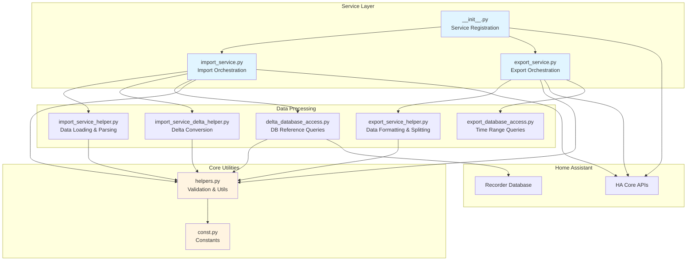
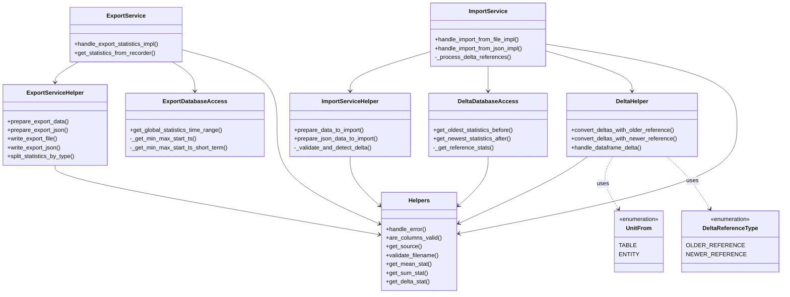
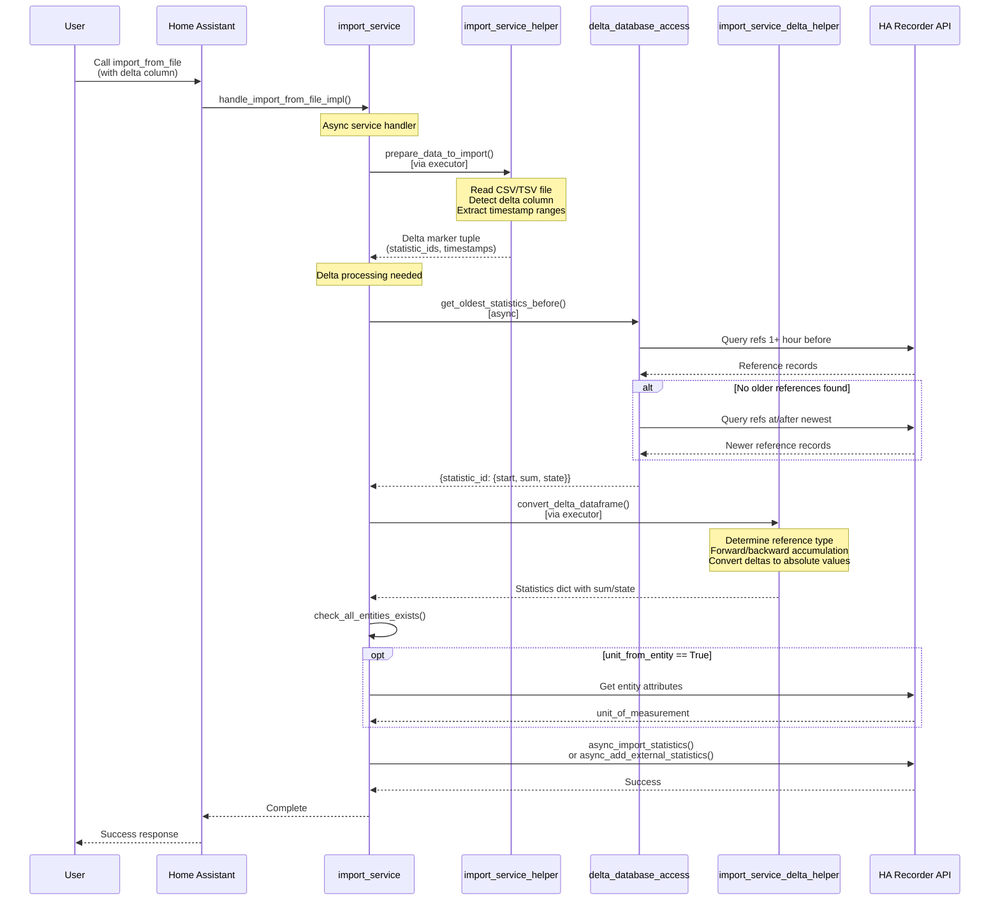
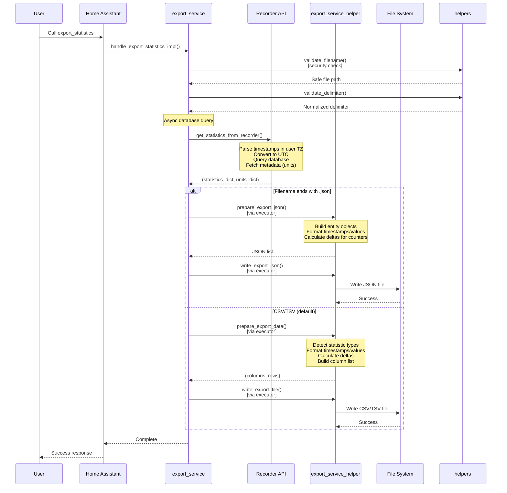

# Architecture Description: Home Assistant Statistics Import/Export Integration

## Overview

The `import_statistics` integration is a **service-based** Home Assistant custom component that provides bidirectional data flow for long-term statistics. Unlike typical integrations, it has no entities, platforms, or background coordinators - it operates purely through service calls.

**Key Characteristics:**
- **Service-Only Integration**: No entities, sensors, or continuous background tasks
- **Bidirectional Data Flow**: Import from files → Home Assistant, Export from Home Assistant → files
- **Dual Statistic Types**: Internal (recorder) and External (custom) statistics
- **Delta Processing**: Complex conversion system for delta-based statistics
- **File Format Support**: CSV, TSV, and JSON formats

---

## Package Structure

```
custom_components/import_statistics/
├── __init__.py                    # Integration entry point and service registration
├── manifest.json                  # Integration metadata and dependencies
├── config_flow.py                 # UI configuration flow (minimal)
├── const.py                       # Constants and attribute definitions
├── services.yaml                  # Service specifications for UI
├── helpers.py                     # Core validation, conversion, and utilities
├── import_service.py              # Main import service handler
├── export_service.py              # Main export service handler
├── import_service_helper.py       # Import data preparation and parsing
├── export_service_helper.py       # Export data formatting and file writing
├── import_service_delta_helper.py # Delta conversion algorithms
├── delta_database_access.py       # Database reference operations for deltas
└── translations/                  # Localization files
    ├── en.json                    # English translations
    └── icons.json                 # Service icons
```

---

## Home Assistant Entry Points

### [`__init__.py`](custom_components/import_statistics/__init__.py)
**Role**: Integration initialization and service registration

**Key Functions:**
- [`setup(hass, config)`](custom_components/import_statistics/__init__.py:16): Main entry point called by Home Assistant
  - Registers three services: `import_from_file`, `import_from_json`, `export_statistics`
  - Returns `True` on successful initialization
- [`async_setup_entry(hass, entry)`](custom_components/import_statistics/__init__.py:41): Config entry setup (currently empty)

**Service Registration Pattern:**
```python
# Synchronous setup registers async handlers
hass.services.register(DOMAIN, "import_from_file", handle_import_from_file)
```

**Connection Points:**
- Calls `import_service.py` handlers
- Uses `const.py` for domain name
- No direct database access

### [`config_flow.py`](custom_components/import_statistics/config_flow.py)
**Role**: UI-based integration setup

**Key Classes:**
- [`ImportStatisticsConfigFlow`](custom_components/import_statistics/config_flow.py:10): Handles configuration flow
  - Minimal implementation - creates empty config entry
  - Supports both UI and configuration.yaml setup

**Connection Points:**
- Uses `const.py` for domain
- No dependencies on other modules

### [`manifest.json`](custom_components/import_statistics/manifest.json)
**Role**: Integration metadata and dependency declaration

**Key Settings:**
- `domain`: "import_statistics"
- `dependencies`: ["recorder"] - Requires recorder component
- `requirements`: ["pandas>=2.0.0"] - Data processing library
- `integration_type`: "service" - Service-only integration
- `single_config_entry`: true - Only one instance allowed

---

## Core Service Layer

### [`import_service.py`](custom_components/import_statistics/import_service.py)
**Role**: Main import service orchestration and delta processing

**Key Functions:**
- [`handle_import_from_file_impl(hass, call)`](custom_components/import_statistics/import_service.py:274): File-based import entry point
- [`handle_import_from_json_impl(hass, call)`](custom_components/import_statistics/import_service.py:295): JSON-based import entry point
- [`_process_delta_references_for_statistic()`](custom_components/import_statistics/import_service.py:27): Delta reference resolution

**Architecture Pattern:**
1. **Async Service Handler**: Receives service call
2. **Data Preparation**: Uses helper modules for parsing
3. **Delta Detection**: Determines if delta processing needed
4. **Reference Fetching**: Async database queries for delta conversion
5. **Database Import**: Uses Home Assistant recorder API

**Connection Points:**
- **Calls**: `import_service_helper.py`, `import_service_delta_helper.py`, `delta_database_access.py`
- **Uses**: `helpers.py` for validation
- **Database**: Home Assistant recorder API (`async_import_statistics`)

### [`export_service.py`](custom_components/import_statistics/export_service.py)
**Role**: Main export service orchestration

**Key Functions:**
- [`handle_export_statistics_impl(hass, call)`](custom_components/import_statistics/export_service.py:173): Export service entry point
- [`get_statistics_from_recorder()`](custom_components/import_statistics/export_service.py:36): Database querying with optional parameters

**Architecture Pattern:**
1. **Parameter Validation**: Extract and validate service parameters
2. **Entity Resolution**: If entities list is empty/None, fetch all statistics from database using `list_statistic_ids()`
3. **Time Range Resolution**: Auto-detect start/end times if not provided using database metadata
4. **Database Query**: Fetch statistics using recorder API
5. **Split Processing**: Optional separation of sensors vs counters into different files
6. **Data Formatting**: Use helper for formatting and file writing
7. **File Output**: Write to config directory with security validation

**Key Features:**
- **Optional Entities Parameter**: When entities field is omitted or empty, exports all statistics in the database
- **Flexible Time Range**: Optional start_time/end_time with auto-detection from database
- **File Splitting**: New `split_by` option to separate sensors and counters into different files
- **Performance Optimized**: Efficient database queries with proper async handling

**Connection Points:**
- **Calls**: `export_service_helper.py`, `export_database_access.py`
- **Uses**: `helpers.py` for validation
- **Database**: Home Assistant recorder API (`statistics_during_period`, `get_metadata`, `list_statistic_ids`)

---

## Data Processing Layer

### [`helpers.py`](custom_components/import_statistics/helpers.py)
**Role**: Core validation, conversion utilities, and error handling

**Key Classes:**
- [`UnitFrom`](custom_components/import_statistics/helpers.py:20): Enum for unit source (TABLE vs ENTITY)
- [`DeltaReferenceType`](custom_components/import_statistics/helpers.py:27): Enum for delta reference types

**Key Functions:**
- [`get_source(statistic_id)`](custom_components/import_statistics/helpers.py:34): Statistic ID validation and source detection
- [`are_columns_valid(df, unit_from_where)`](custom_components/import_statistics/helpers.py:225): DataFrame structure validation
- [`handle_error(error_string)`](custom_components/import_statistics/helpers.py:282): Centralized error handling
- [`validate_filename(filename, config_dir)`](custom_components/import_statistics/helpers.py:366): Export filename security validation

**Validation Rules:**
- Statistic IDs: `sensor.name` (internal) or `domain:name` (external)
- DataFrame columns: Required `statistic_id`, `start`, and conditional `unit`
- Value columns: Either `(mean, min, max)` OR `(sum, state)` OR `delta` - never mixed
- Time constraints: Full hour timestamps only

**Connection Points:**
- **Used by**: All other modules for validation
- **No dependencies**: Pure functions with minimal HA dependencies

### [`import_service_helper.py`](custom_components/import_statistics/import_service_helper.py)
**Role**: Import data preparation and file parsing

**Key Functions:**
- [`prepare_data_to_import()`](custom_components/import_statistics/import_service_helper.py:52): Main data preparation pipeline
- [`prepare_json_data_to_import()`](custom_components/import_statistics/import_service_helper.py:234): JSON-specific preparation
- [`_validate_and_detect_delta()`](custom_components/import_statistics/import_service_helper.py:28): Delta detection logic

**Processing Pipeline:**
1. **File Reading**: CSV/TSV parsing with pandas
2. **Column Validation**: Using `helpers.py` validation
3. **Delta Detection**: Identify delta columns
4. **Data Transformation**: Convert to Home Assistant format
5. **Unit Resolution**: Handle unit sources

**Connection Points:**
- **Calls**: `helpers.py` for validation
- **Used by**: `import_service.py`
- **No HA dependencies**: Pure data processing

### [`export_service_helper.py`](custom_components/import_statistics/export_service_helper.py)
**Role**: Export data formatting and file operations

**Key Functions:**
- [`prepare_export_data()`](custom_components/import_statistics/export_service_helper.py:69): Data formatting for export
- [`prepare_export_json()`](custom_components/import_statistics/export_service_helper.py:179): JSON-specific formatting
- [`write_export_file()`](custom_components/import_statistics/export_service_helper.py:14): File writing operations
- [`split_statistics_by_type()`](custom_components/import_statistics/export_service_helper.py:42): Separate sensors from counters

**Formatting Pipeline:**
1. **Data Conversion**: Transform database results to export format
2. **Type Detection**: Identify sensor vs counter statistics
3. **Timezone Handling**: Convert timestamps to target timezone
4. **Decimal Formatting**: Support comma/dot decimal separators
5. **Delta Calculation**: Compute delta values for counter statistics
6. **File Writing**: CSV/TSV/JSON output with specified delimiters

**Key Features:**
- **Mixed Type Support**: Handle sensors and counters in same export with sparse columns
- **Split Processing**: Separate statistics by type for different files
- **Delta Calculation**: Automatic delta computation for counter statistics
- **Format Flexibility**: Support multiple output formats and delimiters

**Connection Points:**
- **Calls**: `helpers.py` for formatting utilities
- **Used by**: `export_service.py`
- **No HA dependencies**: Pure file operations

---

## Delta Processing System

### [`import_service_delta_helper.py`](custom_components/import_statistics/import_service_delta_helper.py)
**Role**: Delta-to-absolute conversion algorithms

**Key Functions:**
- [`convert_deltas_with_older_reference()`](custom_components/import_statistics/import_service_delta_helper.py:17): Forward accumulation from older reference
- [`convert_deltas_with_newer_reference()`](custom_components/import_statistics/import_service_delta_helper.py:85): Backward accumulation from newer reference
- [`handle_dataframe_delta()`](custom_components/import_statistics/import_service_delta_helper.py:155): Main delta processing orchestration

**Conversion Algorithms:**
- **Older Reference**: Start from database value, accumulate deltas forward
- **Newer Reference**: Start from database value, accumulate deltas backward
- **Validation**: Ensure chronological ordering and mathematical consistency

**Connection Points:**
- **Calls**: `helpers.py` for validation
- **Used by**: `import_service.py`
- **No HA dependencies**: Pure mathematical operations

### [`delta_database_access.py`](custom_components/import_statistics/delta_database_access.py)
**Role**: Database reference operations for delta conversion

**Key Functions:**
- [`get_oldest_statistics_before()`](custom_components/import_statistics/delta_database_access.py:55): Fetch older reference data
- [`get_newest_statistics_after()`](custom_components/import_statistics/delta_database_access.py:85): Fetch newer reference data
- [`_get_reference_stats()`](custom_components/import_statistics/delta_database_access.py:16): Low-level database query

**Database Access Pattern:**
1. **Session Management**: Use recorder's session scope
2. **Query Construction**: Use Home Assistant's statistics query functions
3. **Data Extraction**: Convert database rows to Python objects
4. **Async Operations**: All database operations are async

**Connection Points:**
- **Uses**: Home Assistant recorder database API
- **Used by**: `import_service.py` for reference fetching
- **Database**: Direct access to recorder statistics tables

---

## Configuration and Localization

### [`const.py`](custom_components/import_statistics/const.py)
**Role**: Constants and attribute definitions

**Key Constants:**
- Service parameter names (`ATTR_FILENAME`, `ATTR_TIMEZONE_IDENTIFIER`, etc.)
- Default formats (`DATETIME_DEFAULT_FORMAT`, `DATETIME_INPUT_FORMAT`)
- Test file paths (`TESTFILEPATHS`)

**Connection Points:**
- **Used by**: All modules for consistent parameter naming
- **No dependencies**: Pure constants

### [`services.yaml`](custom_components/import_statistics/services.yaml)
**Role**: Service specifications for Home Assistant UI

**Service Definitions:**
- `import_from_file`: File-based import parameters
- `import_from_json`: JSON-based import parameters
- `export_statistics`: Export parameters (entities field is optional - omit to export all statistics)

**Parameter Specifications:**
- Data types and validation rules
- Default values and examples
- UI selectors and options
- Optional vs required field markers

### [`translations/`](custom_components/import_statistics/translations/)
**Role**: Localization support

**Files:**
- [`en.json`](custom_components/import_statistics/translations/en.json): English translations for services and config flow
- [`icons.json`](custom_components/import_statistics/translations/icons.json): Service icons

---

## Implementation and Debugging Guide

### Where to Implement New Features

#### **New Import Formats**
- **Location**: `import_service_helper.py`
- **Pattern**: Add new preparation function similar to `prepare_json_data_to_import()`
- **Integration**: Call from `import_service.py` handlers

#### **New Export Formats**
- **Location**: `export_service_helper.py`
- **Pattern**: Add new formatting function similar to `prepare_export_json()`
- **Integration**: Call from `export_service.py`

#### **New Validation Rules**
- **Location**: `helpers.py`
- **Pattern**: Add validation function and call from `are_columns_valid()`
- **Integration**: Used throughout for consistent validation

#### **New Services**
- **Location**: `__init__.py` (registration), `services.yaml` (specification)
- **Pattern**: Add service handler in `setup()` function
- **Integration**: Follow async service handler pattern

### Where to Debug Issues

#### **Service Call Problems**
- **Entry Point**: `__init__.py` service registration
- **Parameter Issues**: `services.yaml` specifications
- **Handler Problems**: `import_service.py` or `export_service.py`

#### **Data Validation Errors**
- **Location**: `helpers.py` validation functions
- **Common Issues**: Column validation, statistic ID format, timestamp format
- **Debug Strategy**: Check `are_columns_valid()` and `get_source()` results

#### **File Processing Problems**
- **Import Issues**: `import_service_helper.py` parsing functions
- **Export Issues**: `export_service_helper.py` formatting functions
- **File Access**: Check `validate_filename()` for export security

#### **Database Problems**
- **Import Issues**: `import_service.py` database insertion
- **Export Issues**: `export_service.py` database querying
- **Delta Issues**: `delta_database_access.py` reference fetching

#### **Delta Conversion Problems**
- **Algorithm Issues**: `import_service_delta_helper.py` conversion functions
- **Reference Issues**: `delta_database_access.py` reference queries
- **Detection Issues**: `import_service_helper.py` delta detection

### Key Classes and Relationships

```
Service Layer:
├── ImportService (import_service.py)
│   ├── ImportServiceHelper (import_service_helper.py)
│   ├── ImportServiceDeltaHelper (import_service_delta_helper.py)
│   └── DeltaDatabaseAccess (delta_database_access.py)
└── ExportService (export_service.py)
    └── ExportServiceHelper (export_service_helper.py)

Shared Layer:
└── Helpers (helpers.py)
    ├── Validation Functions
    ├── Error Handling
    └── Utility Functions

Configuration:
├── Constants (const.py)
├── Service Specs (services.yaml)
└── Translations (translations/)
```

### Data Flow Patterns

#### **Import Flow:**
```
Service Call → import_service.py → import_service_helper.py → helpers.py
                ↓                    ↓                    ↓
         Delta Detection → Delta Processing → Database Insert
                ↓                    ↓
         delta_database_access.py → import_service_delta_helper.py
```

#### **Export Flow:**
```
Service Call → export_service.py → Database Query → export_service_helper.py
                ↓                    ↓                    ↓
         Parameter Validation → Data Formatting → File Writing
                ↓                    ↓
         helpers.py → File System
```

---

## Architecture Diagrams

### Module Dependency Diagram

This diagram shows the internal dependencies between modules and their connections to Home Assistant core:



### Class Structure Diagram

This diagram shows the key classes, enums, and their relationships:



### Import Data Flow (with Delta Processing)

This sequence diagram shows the complete import flow when delta columns are present:



### Export Data Flow

This sequence diagram shows the export flow for generating CSV/TSV or JSON files:



---

## Usage Examples

### Export Statistics Service

#### Export All Statistics with Auto-Detected Range
```yaml
action: import_statistics.export_statistics
data:
  filename: all_statistics.tsv
  # All parameters optional - exports everything
  # entities: omitted (exports all)
  # start_time: omitted (auto-detect earliest)
  # end_time: omitted (auto-detect latest)
  split_by: both  # Separate sensors and counters
```

#### Export Specific Entities with Time Range
```yaml
action: import_statistics.export_statistics
data:
  filename: exported_statistics.tsv
  entities:
    - sensor.temperature
    - sensor.energy_consumption
    - sensor:ext_value
  start_time: "2025-12-22 12:00:00"
  end_time: "2025-12-25 12:00:00"
  timezone_identifier: Europe/Vienna
  delimiter: \t
  decimal: false
```

#### Export All Statistics (Enhanced)
```yaml
action: import_statistics.export_statistics
data:
  filename: all_statistics.tsv
  # entities field omitted - exports all statistics in database
  # start_time/end_time optional - auto-detect from database
  split_by: both  # Optional: separate sensors/counters
  timezone_identifier: Europe/Vienna
```

**Enhanced Features:**
- **Auto-Discovery**: Automatically finds all statistic IDs in the database
- **Flexible Time Range**: Optional start_time/end_time with database auto-detection
- **File Splitting**: New `split_by` option (`none|sensor|counter|both`)
- **Performance**: Optimized for large datasets (450k+ records in 30-60 seconds)

**Use Cases:**
- Full database backups and migrations
- Discovering available statistics in the system
- Splitting large exports by type for re-importing
- Automated backup systems with flexible scheduling

---

## External System Integration

### Home Assistant APIs Used
- **Recorder Statistics**: `statistics_during_period`, `async_import_statistics`, `get_metadata`, `list_statistic_ids`
- **Database Access**: Direct recorder database access for delta references and time range queries
- **Entity Validation**: `valid_entity_id`, `valid_statistic_id`
- **Error Handling**: `HomeAssistantError` exception hierarchy

### Performance Characteristics
- **Large Dataset Handling**: Exports of 450,000+ statistics complete in 30-60 seconds on Raspberry Pi hardware
- **Memory Efficiency**: Streaming data processing prevents memory exhaustion
- **Database Optimization**: Single queries for metadata and statistics minimize database load
- **Async Processing**: Non-blocking I/O operations maintain Home Assistant responsiveness

### File System Access
- **Import**: Read from config directory (user-provided files)
- **Export**: Write to config directory with security validation
- **Security**: Path traversal protection in `validate_filename()`

### Dependencies
- **pandas**: Data manipulation and CSV/TSV parsing
- **zoneinfo**: Timezone handling (Python 3.12+)
- **Home Assistant Core**: Recorder component and statistics API

---

## Error Handling Architecture

### Centralized Error Pattern
All modules use [`handle_error()`](custom_components/import_statistics/helpers.py:282) from `helpers.py`:
- **Dual Action**: Logs warning AND raises `HomeAssistantError`
- **Consistency**: Same error format throughout codebase
- **Propagation**: Errors bubble up through service handlers

### Validation Layers
1. **Parameter Validation**: Service call parameters
2. **File Format Validation**: DataFrame structure and content
3. **Business Logic Validation**: Statistic IDs, timestamps, values
4. **Database Validation**: Reference existence and data consistency

### Common Error Scenarios
- **Invalid Statistic ID**: Format or domain issues
- **Column Mismatch**: Missing or extra columns in import data
- **Timestamp Issues**: Non-full-hour timestamps or format problems
- **Delta Reference Missing**: No suitable database reference found
- **File Access Issues**: Permission problems or path traversal attempts
