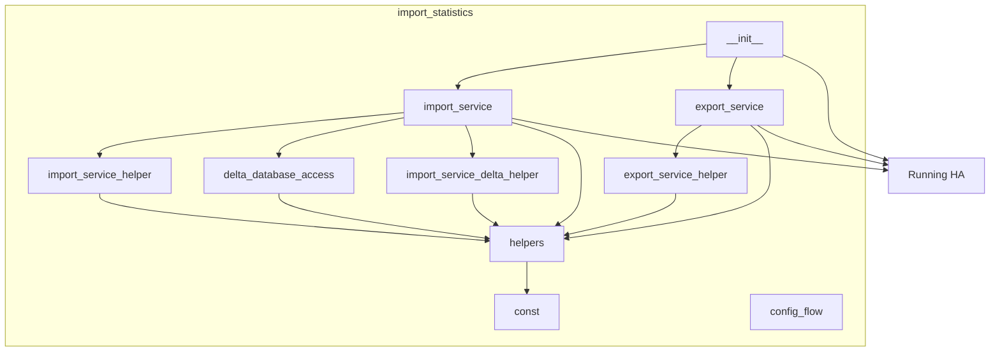
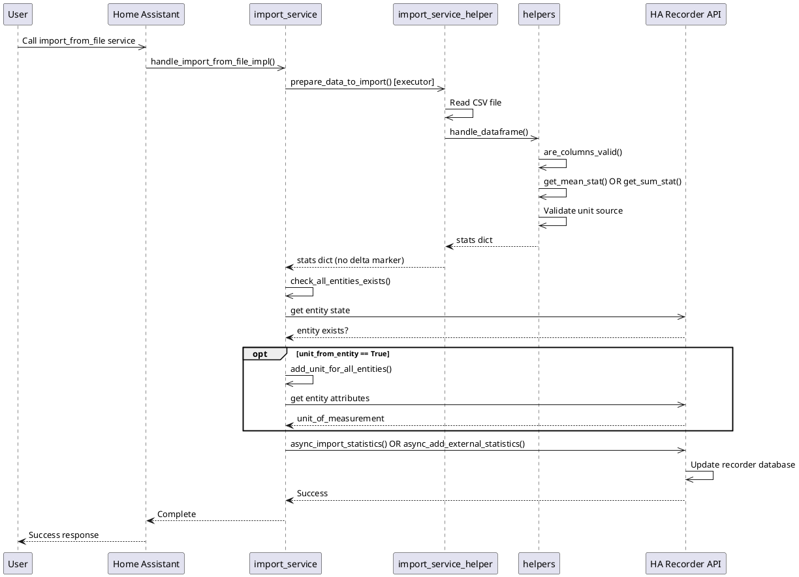
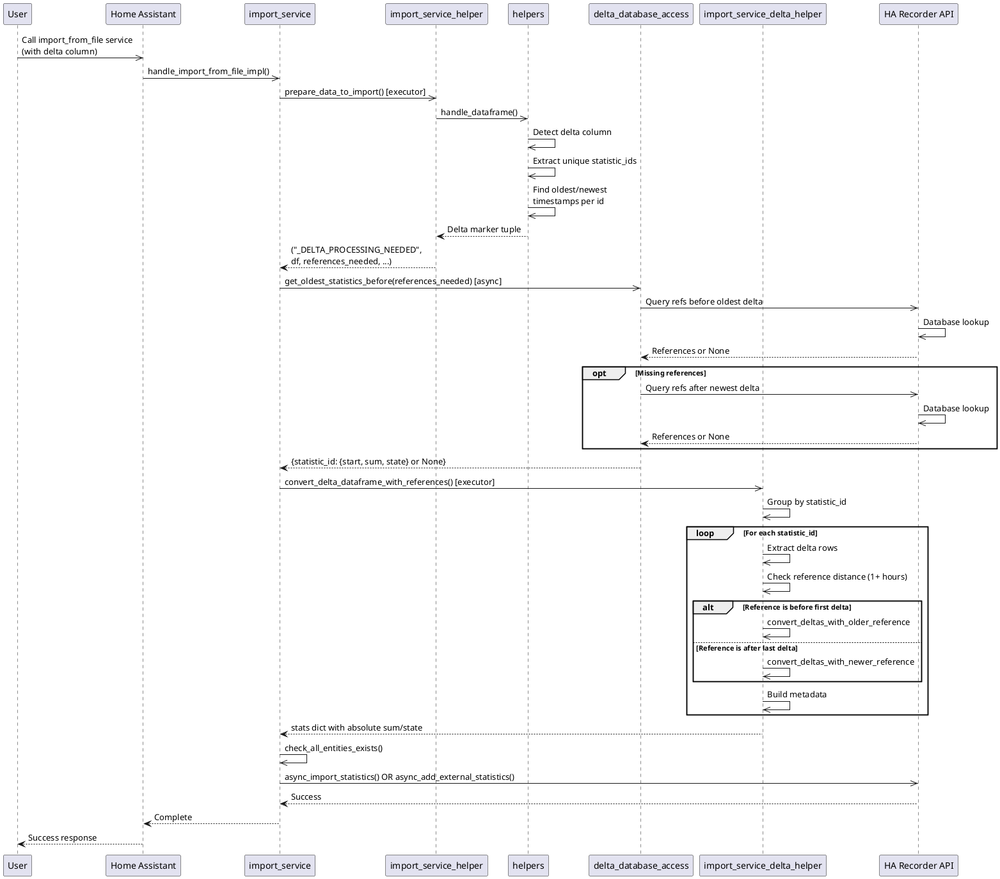
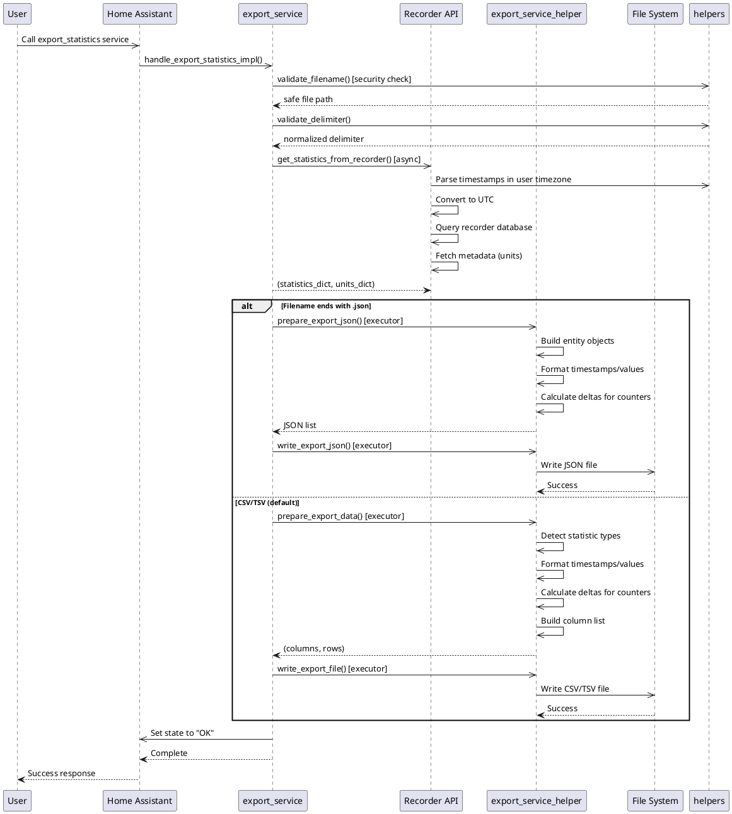

# Architecture Description

## Overview

The `import_statistics` integration provides functionality to import and export Home Assistant long-term statistics from/to CSV, TSV, and JSON files. It handles two types of statistics:

- **Internal Statistics** (recorder source): Uses entity format `sensor.name`, sources from existing Home Assistant entities
- **External Statistics** (custom source): Uses format `domain:name`, creates new synthetic statistics

The architecture features dual import paths (delta and normal), delta conversion with database reference lookups, and flexible export formatting.

---

## Component Description

### [`__init__.py`](custom_components/import_statistics/__init__.py)

Integration entry point that registers three Home Assistant services: `import_from_file` (CSV/TSV import), `import_from_json` (JSON import), and `export_statistics` (export to file). Uses synchronous `setup()` to register async service handlers.

---

### [`import_service.py`](custom_components/import_statistics/import_service.py)

Orchestrates the import flow for both file and JSON sources. Detects delta processing needs via marker tuple, coordinates async database reference lookups, and dispatches to appropriate converters. Validates entity existence for internal statistics and optionally fetches units from entity attributes before calling Home Assistant's recorder API.

---

### [`import_service_helper.py`](custom_components/import_statistics/import_service_helper.py)

Handles data loading and DataFrame processing for imports. Loads CSV/TSV files with configurable delimiters and decimal separators, or constructs DataFrames from JSON input. Core processing validates columns and either extracts statistics directly (non-delta path) or returns a delta marker tuple with timestamp ranges for async database lookup (delta path).

---

### [`import_service_delta_helper.py`](custom_components/import_statistics/import_service_delta_helper.py)

Pure calculation functions for converting delta values to absolute sum/state values. Supports two conversion strategies: forward accumulation (reference before import range) and backward subtraction (reference at or after import range). All calculations are synchronous with pre-fetched database references.

---

### [`delta_database_access.py`](custom_components/import_statistics/delta_database_access.py)

Async database query functions for fetching delta conversion reference values. Implements two-pass lookup strategy: first attempts to find references before the oldest import timestamp, then falls back to references at or after the newest timestamp. Validates references are at least 1 hour away from import range.

---

### [`export_service.py`](custom_components/import_statistics/export_service.py)

Export service handler that fetches statistics from Home Assistant's recorder API, validates file paths and delimiters, and dispatches to appropriate formatters based on file extension (JSON vs CSV/TSV). Handles timezone conversion from UTC storage to user's local timezone for display.

---

### [`export_service_helper.py`](custom_components/import_statistics/export_service_helper.py)

Data formatting and file writing for exports. Detects statistic types (sensors vs counters), sorts records chronologically, formats timestamps and numeric values, and calculates delta columns for counters. Supports both CSV/TSV (with configurable delimiters) and JSON output formats.

---

### [`helpers.py`](custom_components/import_statistics/helpers.py)

Pure validation and conversion functions with no Home Assistant dependencies (except error handling). Provides the core validation pipeline including:

- Statistic ID format validation and source detection (recorder vs external)
- DataFrame column structure validation
- Row-level data extraction and validation for mean/min/max, sum/state, and delta statistics
- Constraint validation (min ≤ mean ≤ max, full hour timestamps)
- Unit source selection logic (TABLE vs ENTITY)
- File path security validation
- Timezone-aware datetime formatting
- Centralized error handling via `handle_error()`

---

### [`const.py`](custom_components/import_statistics/const.py)

Constants and configuration defaults including domain name, service parameter names, and datetime formats.

---

### [`config_flow.py`](custom_components/import_statistics/config_flow.py)

Minimal configuration flow using empty config schema.

---

## Module Dependencies

This section describes the internal module dependencies within the integration and the external dependencies to a running Home Assistant. The architecture follows a layered approach where pure validation functions ([`helpers.py`](custom_components/import_statistics/helpers.py)) have minimal dependencies, while service handlers coordinate between Home Assistant APIs and business logic.



---

<!-- ## Data Flow Diagrams

### Normal Import Flow (without Delta)



### Delta Import Flow



### Export Flow



--- -->

## Key Architectural Patterns

### 1. Dual-Mode Statistics System

Two mutually exclusive types with different validation and source rules:


| Aspect      | Internal (recorder)           | External (custom)                 |
| ------------- | ------------------------------- | ----------------------------------- |
| Format      | `sensor.name` (dot separator) | `domain:name` (colon separator)   |
| Source      | Existing HA entity            | New synthetic entity              |
| Unit Source | Flexible (entity or CSV)      | Must be from CSV (TABLE)          |
| Validation  | Entity must exist in HA       | Domain cannot be "recorder"       |
| HA API      | `async_import_statistics()`   | `async_add_external_statistics()` |

### 2. Validation Pipeline

Distributed across multiple stages rather than centralized:

1. **Pre-processing**: File path security, delimiter normalization
2. **Column-level**: `are_columns_valid()` checks structure and column requirements
3. **Row-level**: Individual extraction functions validate values (silent failure on error)
4. **Constraint-level**: Relationship validation (min ≤ mean ≤ max, timestamp full hour)

### 3. Delta Processing Architecture

Three-stage async pipeline with reference lookups:

```
CSV with delta column
  ↓
[Stage 1] prepare_data_to_import() [sync via executor]
  - Detect delta column
  - Extract statistic_ids with oldest/newest timestamps
  - Return marker tuple
  ↓
[Stage 2] get_oldest_statistics_before() [async]
  - Query database for older references (1+ hour before)
  - Query database for newer references (1+ hour after) if older is missing
  - Return pre-fetched references
  ↓
[Stage 3] convert_delta_dataframe_with_references() [sync via executor]
  - Pure calculation: no HA dependency
  - Detect older reference vs newer reference from reference timestamp
  - Convert deltas to absolute values via accumulation or subtraction
  - Build metadata and statistics list
```

### 4. Async/Sync Hybrid Pattern

- Service handlers are async (required by HA)
- Data preparation (CSV/JSON parsing) runs sync via executor (avoids blocking)
- Database queries run async (native async support in HA)
- Pure calculations run sync via executor (testable independently)

### 5. Error Handling

Centralized via [`handle_error()`](custom_components/import_statistics/helpers.py:282):

- Always logs warning
- Always raises HomeAssistantError
- Ensures consistent error behavior across all functions

### 6. Timezone Conversion (Bidirectional)

**Import**: User's timezone → UTC

- User provides timestamps in local timezone
- Parsed with `zoneinfo.ZoneInfo(timezone_id)`
- Converted to UTC for internal storage: `.astimezone(dt.UTC)`

**Export**: UTC → User's timezone

- Recorder stores all times in UTC
- Converted to user's timezone for display: `.astimezone(tz)`
- Formatted using user's datetime format preference

### 7. File Path Security

Defense-in-depth for export filenames:

1. Reject absolute paths (start with `/`)
2. Reject `..` directory traversal sequences
3. Resolve final path using `Path.resolve()`
4. Verify within config_dir using `Path.relative_to()`

---

## Testing Strategy

The architecture supports multiple test levels:

1. **Unit Tests** (`tests/unit_tests/`):

   - Test pure functions in `helpers.py`, `import_service_delta_helper.py`
   - No Home Assistant mocks required
   - Fast execution
2. **Integration Tests with Mocks** (`tests/integration_tests_mock/`):

   - Test service handlers with mocked Home Assistant
   - Uses `pytest-homeassistant-custom-component`
   - Tests delta detection and conversion flow
3. **Integration Tests with Real HA** (`tests/integration_tests/`):

   - Tests against running Home Assistant instance
   - Requires HA_TOKEN_DEV environment variable
   - Validates full import/export workflow with actual database
   - Only passes when database is deleted before the test (the reason is that the import commands change the database):
     - If HA is not running, the test does that
     - If HA is running, its the responsibility of the user to prepare the database

---

## Error Handling Strategy

All validation errors use [`handle_error()`](custom_components/import_statistics/helpers.py:282):

```python
# Pattern used throughout codebase:
if validation_failed:
    handle_error(f"Descriptive error message: {details}")
```

This ensures:

- Consistent logging (warning level)
- Consistent exception type (HomeAssistantError)
- Visible to Home Assistant logs
- Prevents silent failures

Silent failures occur only at row-level during extraction:

- `get_delta_stat()` returns empty dict on validation failure
- Invalid rows are skipped (not imported)
- Logged as debug or warning, continues processing

---

## Data Structures

### Statistics Dictionary Structure

```python
{
    "sensor.temperature": (
        {
            "source": "recorder",
            "statistic_id": "sensor.temperature",
            "mean_type": StatisticMeanType.ARITHMETIC,
            "has_sum": False,
            "unit_of_measurement": "°C",
            "name": None,
            "unit_class": None,
        },
        [
            {
                "start": datetime(...),  # timezone-aware
                "min": 15.2,
                "max": 22.5,
                "mean": 18.7,
            },
            # ... more records
        ]
    ),
    "power:total": (
        {
            "source": "power",
            "statistic_id": "power:total",
            "mean_type": StatisticMeanType.NONE,
            "has_sum": True,
            "unit_of_measurement": "kWh",
            "name": None,
            "unit_class": None,
        },
        [
            {
                "start": datetime(...),  # timezone-aware
                "sum": 1234.56,
                "state": 1234.56,
            },
            # ... more records
        ]
    ),
}
```

### References Dictionary (for Delta Import)

```python
{
    "sensor.energy": {
        "start": datetime(...),  # datetime of reference record
        "sum": 5432.1,          # sum value at reference time
        "state": 5432.1,        # state value at reference time
    },
    "power:total": None,  # No reference found (error case)
}
```

### Delta Marker Tuple

```python
(
    "_DELTA_PROCESSING_NEEDED",  # Marker string
    df,                          # DataFrame with delta column
    {                            # references_needed dict
        "sensor.energy": (oldest_dt_utc, newest_dt_utc),
        "power:total": (oldest_dt_utc, newest_dt_utc),
    },
    "Europe/Vienna",             # timezone_identifier
    "%d.%m.%Y %H:%M",           # datetime_format
    UnitFrom.TABLE,             # unit_from_where
)
```

---

## Known Limitations & Design Decisions

1. **No Transaction Rollback**: Partial imports succeed if some rows validate
2. **Row-Level Silent Failures**: Invalid rows skipped, not reported individually
3. **Data Format Asymmetry**: Export allows mixed sensor/counter data, import requires separation
4. **Timezone Validation**: Must be valid in both directions (checked against pytz.all_timezones)
5. **Full-Hour Timestamps**: All timestamps must be at exact hour boundary (minutes=0, seconds=0)
