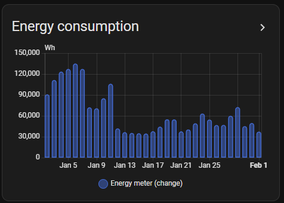
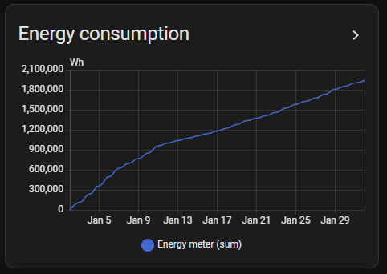

# Understanding counter statistics in Home Assistant

## Understanding Counter Statistics (sum/state)

There are two types of statistics:
- measurement type with a state_class `measurement` or `measurement_angle`
- counter type with a state_class `total` or `total_increasing`

Counter statistics (like energy meters) are more complex than measurement statistics. Here's what you need to know:

### What are `sum` and `state`?

| Column | Description | Example |
|--------|-------------|---------|
| **state** | The actual meter reading | `6913.045 kWh` (your meter shows this) |
| **sum** | Cumulative value since counter creation | Can be identical to `state` if the counter started at 0 when connected to HA |
| **delta** | Change of `sum` in previous hour | `0.751 kWh` consumed this hour |

> `last_reset` is not explained. As long as the `sum` attribute increases monotonically, the integration should handle this fine.

### How Home Assistant Records Counter Statistics

Home Assistant provides support to process statistics through the following simplified workflow:

1. **Entity state changes** are recorded in the `states` table (sampled every 5 seconds by default)
2. **Every 5 minutes**, the statistics compilation process writes to `statistics_short_term`
3. **Every 60 minutes**, short-term statistics are aggregated into `statistics`

> Note that the states are not stored in the state table if their value has not changed or is invalid (`unavailable` and `unknown`)

The statistics and statistics_short_term tables store the following information :

| Field           | Description                                                     | Example                             |
| ----------------- | ----------------------------------------------------------------- | ------------------------------------- |
| `id`            | Primary key for this statistic record                           | Auto-increment                      |
| `created_ts`    | When the statistics were calculated and written to the database | 2024-01-11 12:05:00                 |
| `metadata_id`   | Foreign key to statistics_meta                                  | References statistics_meta.id       |
| `start_ts`      | Unix timestamp of period start                                  | 2024-01-11 12:00:00 (start of hour) |
| `mean`          | Average value during the period                                 | 234.5 (average voltage)             |
| `mean_weight`   | Weight factor for circular averaging (angular measurements)     | 0.95 (high consistency)             |
| `min`           | Minimum value during the period                                 | 230.0 (lowest voltage)              |
| `max`           | Maximum value during the period                                 | 238.0 (highest voltage)             |
| `last_reset_ts` | When the counter last reset (for sum)                           | Timestamp of reset, or NULL         |
| `state`         | Last known state at end of period                               | 235.0 (final voltage reading)       |
| `sum`           | Cumulative sum (for counters like energy)                       | 1523.4 (total kWh)                  |

Here is an example of an energy counter:

| statistic_id | period_start | created_at | state | sum | period_delta |
| ------------ | ------------ | ---------- | ----- | --- | ------------ |
| sensor.linky_east | 1/27/2026 13:00 | 1/27/2026 14:00 | 72201200 | 295880 | |
| sensor.linky_east | 1/27/2026 14:00 | 1/27/2026 15:00 | 72202864 | 297544 | 1664 |
| sensor.linky_east | 1/27/2026 15:00 | 1/27/2026 16:00 | 72204536 | 299216 | 1672 |
| sensor.linky_east | 1/27/2026 16:00 | 1/27/2026 17:00 | 72206240 | 300920 | 1704 |

We can see that:
- The sum increases by the same amount as the state. The difference between state and sum is the initial value of the counter. In this example, the initial value is 71905320 (72201200-295880).
- The period_delta is the difference between the sum of the current period and the sum of the previous period. This value is actually
not stored in the database for saving space, but is it used by the statistics graph card (easy to compute) , and it can be used
for importing

The **statistics graph card** can display the state (not very useful), the sum, or the delta. The sum displayed (usually using a line chart) is not the sum from the database, but a cumulative sum that starts at 0 at the beginning of the displayed period (so it is easier to see the consumption on the displayed period). the delta is useful to show the consumption during the specified period (usually using a Bar chart).

 

> In case only a few existing entries should be corrected, its probably easier to use the [Home Assistant developer tools / statistic tab](https://www.home-assistant.io/docs/tools/dev-tools/#statistics-tab) to correct them. The `adjustment value` entered there is the delta of the selected hour, not the sum. What happens in the database is that starting from the selected time, the difference between the `adjustment value` and the value shown in the dialog before is added to all existing sum values. The effect of this is that the delta of the selected time changes, and all other deltas stay the same.

For more details regarding long term statistics, see

- [Home Assistant blog](https://developers.home-assistant.io/blog/2021/08/16/state_class_total/)
- [Home Assistant documentation](https://developers.home-assistant.io/docs/core/entity/sensor/#state_class_total_increasing)
- [Home Assistant developer tools / statistic tab](https://www.home-assistant.io/docs/tools/dev-tools/#statistics-tab)

---

## Delta Import

Instead of importing absolute `sum`/`state` values, you can import **delta** values (the change per hour). This is useful because you

- do not need to calculate sum and state
- do not need to align sum and state values of the import with the sum and state values in the database, which can be a pain.

### How Delta Import Works

1. **Export your current data** using `export_statistics`
2. **Modify the file**:
   - Remove the `sum` and `state` columns
   - Keep or edit the `delta` column
   - Add/remove rows as needed
3. **Import the modified file** using `import_from_file`

The integration automatically converts deltas to absolute values using an existing database entry as reference point.

### Requirements

| Requirement | Details |
|-------------|---------|
| **Reference point** | At least one existing database value 1+ hour before or at/after your import range |
| **Complete coverage** | You must provide values for ALL hours in your import range, which exists in the database (no gaps). This is the case automatically when you start with the exported file |

> **Warning**: Leaving gaps creates strange results:
> If you don't import all DB values in the import time range, you'll create unexpected values. For example, if the database has values at 09:00, 10:00, 11:00, 12:00, 13:00, 14:00 and you only import deltas at 10:00 and 13:00 (with a gap in between), you will get strange results. You have to provide the values for all timestamps in the DB you are importing, in this example you have to provide values for 10:00, 11:00, 12:00, 13:00.

### Delta Import Examples

To better understand what the delta import does, expand and check the examples below.

<details>
<summary><strong>Example 1: Add historical data before sensor existed</strong></summary>

You have data from before your sensor was added to Home Assistant.

Use case: The sensor was not available in Home Assistant before, but there are other sources available

**Database before import:**
- 29.12.2025 08:00: sum=0, state=10
- 29.12.2025 09:00: sum=1, state=11
- 29.12.2025 10:00: sum=3, state=13

**Values to import:**

```tsv
statistic_id	start	unit	delta
sensor.imp_before	28.12.2025 09:00	kWh	10
sensor.imp_before	28.12.2025 10:00	kWh	20
sensor.imp_before	28.12.2025 11:00	kWh	30
```

**Result after import:**
- 28.12.2025 08:00: sum=-60, state=-50 (no delta available, as this is the first value in the database)
- 28.12.2025 09:00: sum=-50, state=-40 (delta: 10)
- 28.12.2025 10:00: sum=-30, state=-20 (delta: 20; sum and state calculated from first database value)
- 28.12.2025 11:00: sum=0, state=10 (delta: 30, connects to existing data, sum and state identical to first database value)
- 29.12.2025 08:00: sum=0, state=10 (existing, delta: 0)
- 29.12.2025 09:00: sum=1, state=11 (existing)
- 29.12.2025 10:00: sum=3, state=13 (existing)

</details>

<details>
<summary><strong>Example 2: Correct values in the middle</strong></summary>

Use case: Your sensor was offline and recorded wrong values.

Use case: Correct values in the middle of the timerange available in the database, e.g. if a sensor was not active for some time

**Database before import:**
- 29.12.2025 08:00: sum=0, state=10
- 29.12.2025 09:00: sum=1, state=11 (delta: 1)
- 29.12.2025 10:00: sum=3, state=13 (delta: 2)
- 29.12.2025 11:00: sum=6, state=16 (delta: 3)
- 29.12.2025 12:00: sum=10, state=20 (delta: 4)
- 29.12.2025 13:00: sum=15, state=25 (delta: 5)
- 29.12.2025 14:00: sum=21, state=31 (delta: 6)
- 29.12.2025 15:00: sum=28, state=38 (delta: 7)
- 29.12.2025 16:00: sum=36, state=46 (delta: 8)

**Values to import:**
```tsv
statistic_id	start	unit	delta
sensor:imp_inside	29.12.2025 09:00	kWh	2
sensor:imp_inside	29.12.2025 10:00	kWh	2
sensor:imp_inside	29.12.2025 11:00	kWh	2
sensor:imp_inside	29.12.2025 12:00	kWh	5
sensor:imp_inside	29.12.2025 13:00	kWh	5
sensor:imp_inside	29.12.2025 14:00	kWh	5
```

**Result after import:**
- 29.12.2025 08:00: sum=0, state=10 (unchanged, reference point)
- 29.12.2025 09:00: sum=2, state=12 (delta: 2, corrected)
- 29.12.2025 10:00: sum=4, state=14 (delta: 2, corrected)
- 29.12.2025 11:00: sum=6, state=16 (delta: 2, corrected)
- 29.12.2025 12:00: sum=11, state=21 (delta: 5, corrected)
- 29.12.2025 13:00: sum=16, state=26 (delta: 5, corrected)
- 29.12.2025 14:00: sum=21, state=31 (delta: 5, corrected)
- 29.12.2025 15:00: sum=28, state=38 (delta: 7, unchanged)
- 29.12.2025 16:00: sum=36, state=46 (delta: 8, unchanged)

> **Important**: Please note there is no "spike" at 29.12.2025 15:00 because the sum of the deltas between 29.12.2025 09:00 and 29.12.2025 14:00 is identical in the database and in the import (both are 21). If there is a difference, then the delta at 29.12.2025 15:00 would be different than before the import, which results in a wrong value at this timestamp e.g. in the energy board.
> Use the [Home Assistant developer tools / statistic tab](https://www.home-assistant.io/docs/tools/dev-tools/#statistics-tab) to correct the wrong delta at this timestamp (the value which is corrected there is the delta of the selected hour, not the sum).
> See next example for such a spike

</details>

<details>
<summary><strong>Example 3: Correct values in the middle (with spike)</strong></summary>

Use case: Your sensor was offline and recorded wrong values. There is a problem in the import file which creates a spike.

**Database before import:**
- 29.12.2025 08:00: sum=0, state=10
- 29.12.2025 09:00: sum=1, state=11 (delta: 1)
- 29.12.2025 10:00: sum=3, state=13 (delta: 2)
- 29.12.2025 11:00: sum=6, state=16 (delta: 3)
- 29.12.2025 12:00: sum=10, state=20 (delta: 4)
- 29.12.2025 13:00: sum=15, state=25 (delta: 5)
- 29.12.2025 14:00: sum=21, state=31 (delta: 6)
- 29.12.2025 15:00: sum=28, state=38 (delta: 7)
- 29.12.2025 16:00: sum=36, state=46 (delta: 8)

**Values to import:**
```tsv
statistic_id	start	unit	delta
sensor:imp_inside_spike	29.12.2025 09:00	kWh	12
sensor:imp_inside_spike	29.12.2025 10:00	kWh	12
sensor:imp_inside_spike	29.12.2025 11:00	kWh	12
sensor:imp_inside_spike	29.12.2025 12:00	kWh	15
sensor:imp_inside_spike	29.12.2025 13:00	kWh	15
sensor:imp_inside_spike	29.12.2025 14:00	kWh	15
```

**Result after import:**
- 29.12.2025 08:00: sum=0, state=10 (unchanged, reference point)
- 29.12.2025 09:00: sum=12, state=22 (delta: 12, corrected - much higher than original 1)
- 29.12.2025 10:00: sum=24, state=34 (delta: 12, corrected)
- 29.12.2025 11:00: sum=36, state=46 (delta: 12, corrected)
- 29.12.2025 12:00: sum=51, state=61 (delta: 15, corrected)
- 29.12.2025 13:00: sum=66, state=76 (delta: 15, corrected)
- 29.12.2025 14:00: sum=81, state=91 (delta: 15, corrected)
- 29.12.2025 15:00: sum=28, state=38 (delta: -53, **spike!** - negative value to compensate)
- 29.12.2025 16:00: sum=36, state=46 (delta: 8, unchanged)

> **Warning: Spike at the boundary** Because the sum of imported deltas (12+12+12+15+15+15 = 81) is much larger than the original database deltas (1+2+3+4+5+6 = 21), the integration creates a negative delta of -53 at 29.12.2025 15:00 to reconnect to the existing database value. This spike will appear in visualizations like the energy board. To avoid this, ensure the total sum of your corrected deltas matches the total sum of the original values in that time range.
> If the sum of the delta is wrong, use the [Home Assistant developer tools / statistic tab](https://www.home-assistant.io/docs/tools/dev-tools/#statistics-tab) to correct the wrong delta at this timestamp (the value which is corrected there is the delta of the selected hour, not the sum).

</details>

<details>
<summary><strong>Example 4: Add values after existing data</strong></summary>

Use case: Manually add consumption data for hours not yet in the database.

**Database before import:**
- 29.12.2025 08:00: sum=0, state=10
- 29.12.2025 09:00: sum=1, state=11
- 29.12.2025 10:00: sum=3, state=13

**Values to import:**
```tsv
statistic_id	start	unit	delta
sensor.imp_after	30.12.2025 09:00	kWh	10
sensor.imp_after	30.12.2025 10:00	kWh	20
sensor.imp_after	30.12.2025 11:00	kWh	30
```

**Result after import:**
- 29.12.2025 08:00: sum=0, state=10 (unchanged)
- 29.12.2025 09:00: sum=1, state=11 (unchanged)
- 29.12.2025 10:00: sum=3, state=13 (unchanged, reference point)
- 30.12.2025 09:00: sum=13, state=23 (delta: 10, new)
- 30.12.2025 10:00: sum=33, state=43 (delta: 20, new)
- 30.12.2025 11:00: sum=63, state=73 (delta: 30, new)
