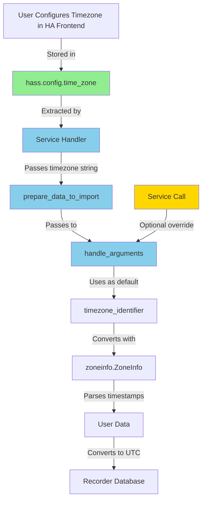

# Service Parameter Improvements Plan

## Overview

This plan outlines improvements to the import/export service parameters to make them more user-friendly and consistent. The changes include:

1. **Timezone handling**: Use Home Assistant's configured timezone as default
2. **Delimiter handling**: Change default to `\t` (tab), make required with default
3. **Decimal separator**: Replace boolean with combobox selector, make required with default
4. **Dependency management**: Pass HA timezone to functions instead of entire `hass` object

---

## Current Issues

### 1. Timezone Handling
- **Import**: Requires users to manually specify timezone (no default)
- **Export**: Has hardcoded default `"Europe/Vienna"` (arbitrary, wrong for most users)
- **Problem**: Users already configured timezone in HA frontend, forcing redundant specification

### 2. Delimiter Handling
- **Current**: Optional parameter with default `\t`
- **Problem**: The code has auto-detection logic that is unnecessary complexity
- **Issue**: Optional parameters with defaults are confusing in the UI

### 3. Decimal Separator
- **Current**: Boolean parameter (`decimal: true` means comma, `false` means dot)
- **Problem**: Boolean is unintuitive - users must remember what true/false means
- **Better**: Explicit combobox with "," and "." options

### 4. Dependency Management
- **Current**: Would need to pass entire `hass` object to [`prepare_data_to_import()`](custom_components/import_statistics/import_service_helper.py:57)
- **Problem**: Introduces unnecessary dependencies to hass for helper functions
- **Better**: Extract timezone string from `hass.config.time_zone` and pass only the string

---

## Proposed Changes

### Change 1: Timezone - Use HA Timezone as Default

#### Rationale
Home Assistant provides the timezone setting through `hass.config.time_zone`, which returns the IANA timezone identifier (e.g., `"Europe/Berlin"`, `"America/New_York"`, `"UTC"`). Users already configured this in the HA frontend, so we should use it as the default.

#### Implementation Strategy

**Pass timezone string, not hass object:**
- Extract timezone in service handlers: `ha_timezone = hass.config.time_zone`
- Pass timezone string to [`handle_arguments()`](custom_components/import_statistics/import_service_helper.py:141)
- Keep helper functions independent of `hass` object

**Files to modify:**

1. **[`custom_components/import_statistics/import_service_helper.py`](custom_components/import_statistics/import_service_helper.py:141)**
   - Modify [`handle_arguments()`](custom_components/import_statistics/import_service_helper.py:141) signature:
     ```python
     def handle_arguments(call: ServiceCall, ha_timezone: str) -> tuple:
         """Handle the arguments for importing statistics from a file."""

         # Use HA's configured timezone as default, allow override
         timezone_identifier = call.data.get(
             ATTR_TIMEZONE_IDENTIFIER,
             ha_timezone  # ✅ Use HA timezone as default
         )

         if timezone_identifier not in pytz.all_timezones:
             helpers.handle_error(f"Invalid timezone_identifier: {timezone_identifier}")

         # ... rest of function unchanged
     ```

2. **[`custom_components/import_statistics/import_service.py`](custom_components/import_statistics/import_service.py)**
   - Extract timezone before calling prepare functions:
     ```python
     async def handle_import_from_file_impl(hass: HomeAssistant, call: ServiceCall) -> None:
         """Handle import_from_file service implementation."""

         # Extract HA timezone once
         ha_timezone = hass.config.time_zone

         # Pass timezone string to prepare function
         df, timezone_id, datetime_format, unit_from_entity, is_delta = await hass.async_add_executor_job(
             lambda: prepare_data_to_import(file_path, call, ha_timezone)
         )
     ```

3. **[`custom_components/import_statistics/import_service_helper.py`](custom_components/import_statistics/import_service_helper.py:57)**
   - Update [`prepare_data_to_import()`](custom_components/import_statistics/import_service_helper.py:57) signature:
     ```python
     def prepare_data_to_import(file_path: str, call: ServiceCall, ha_timezone: str) -> tuple:
         """Load and prepare data from CSV/TSV file for import."""
         decimal, timezone_identifier, delimiter, datetime_format, unit_from_entity = handle_arguments(call, ha_timezone)
         # ... rest unchanged
     ```

4. **[`custom_components/import_statistics/import_service_helper.py`](custom_components/import_statistics/import_service_helper.py:92)**
   - Update [`prepare_json_data_to_import()`](custom_components/import_statistics/import_service_helper.py:92) signature:
     ```python
     def prepare_json_data_to_import(call: ServiceCall, ha_timezone: str) -> tuple:
         """Prepare data from JSON service call for import."""
         _, timezone_identifier, _, datetime_format, unit_from_entity = handle_arguments(call, ha_timezone)
         # ... rest unchanged
     ```

5. **[`custom_components/import_statistics/export_service.py`](custom_components/import_statistics/export_service.py:309)**
   - Update [`handle_export_statistics_impl()`](custom_components/import_statistics/export_service.py:309):
     ```python
     async def handle_export_statistics_impl(hass: HomeAssistant, call: ServiceCall) -> None:
         """Handle export_statistics service implementation."""
         # ... validation code ...

         # Use HA timezone as default instead of hardcoded "Europe/Vienna"
         timezone_identifier = call.data.get(ATTR_TIMEZONE_IDENTIFIER, hass.config.time_zone)

         # ... rest unchanged
     ```

6. **[`custom_components/import_statistics/services.yaml`](custom_components/import_statistics/services.yaml)**
   - Make timezone optional in both services:
     ```yaml
     import_from_file:
       fields:
         timezone_identifier:
           required: false  # ✅ Changed from true to false
           description: >
             Timezone identifier (IANA format, e.g., 'Europe/Berlin').
             If not specified, uses Home Assistant's configured timezone.
           example: "Europe/Berlin"
           selector:
             text:

     export_statistics:
       fields:
         timezone_identifier:
           required: false
           description: >
             Timezone identifier (IANA format, e.g., 'Europe/Berlin').
             If not specified, uses Home Assistant's configured timezone.
           example: "Europe/Berlin"
           selector:
             text:
     ```

#### Benefits
- **User-friendly**: No need to specify timezone in every service call
- **Consistent**: Uses the timezone user already configured in HA
- **Flexible**: Users can still override if needed
- **Clean architecture**: Helper functions remain independent of `hass` object

---

### Change 2: Delimiter - Make Required with Default `\t`

#### Rationale
The delimiter parameter is currently optional, but there's always a default value (`\t`). Making it required with a default simplifies the code and removes unnecessary auto-detection logic.

#### Implementation

1. **[`custom_components/import_statistics/services.yaml`](custom_components/import_statistics/services.yaml)**
   - Change `required: false` to `required: true` for delimiter in both services
   - Keep default as `\t`
   ```yaml
   import_from_file:
     fields:
       delimiter:
         required: true  # ✅ Changed from false to true
         default: \t
         example: \t
         selector:
           select:
             custom_value: true
             options:
               - '\t'
               - ";"
               - ","
               - "|"

   export_statistics:
     fields:
       delimiter:
         required: true  # ✅ Changed from false to true
         default: \t
         example: \t
         selector:
           select:
             custom_value: true
             options:
               - '\t'
               - ";"
               - ","
               - "|"
   ```

2. **[`custom_components/import_statistics/helpers.py`](custom_components/import_statistics/helpers.py:382)**
   - Keep [`validate_delimiter()`](custom_components/import_statistics/helpers.py:382) as is (handles `None` → `"\t"` conversion)
   - This ensures backward compatibility if delimiter is missing

3. **[`custom_components/import_statistics/import_service_helper.py`](custom_components/import_statistics/import_service_helper.py:169)**
   - Update [`handle_arguments()`](custom_components/import_statistics/import_service_helper.py:141):
     ```python
     # Get delimiter with default (required parameter with default in services.yaml)
     delimiter = call.data.get(ATTR_DELIMITER, "\t")
     delimiter = helpers.validate_delimiter(delimiter)
     ```

4. **[`custom_components/import_statistics/export_service.py`](custom_components/import_statistics/export_service.py:316)**
   - Update default in [`handle_export_statistics_impl()`](custom_components/import_statistics/export_service.py:309):
     ```python
     delimiter = helpers.validate_delimiter(call.data.get(ATTR_DELIMITER, "\t"))
     ```

#### Benefits
- **Simpler**: No auto-detection logic needed
- **Clearer**: Users see the default value in the UI
- **Consistent**: Same pattern as other parameters with defaults

---

### Change 3: Decimal Separator - Replace Boolean with Combobox

#### Rationale
The current boolean parameter (`decimal: true` for comma, `false` for dot) is unintuitive. A combobox with explicit values ("," and ".") is much clearer.

#### Implementation

1. **[`custom_components/import_statistics/const.py`](custom_components/import_statistics/const.py)**
   - No changes needed (ATTR_DECIMAL remains the same)

2. **[`custom_components/import_statistics/services.yaml`](custom_components/import_statistics/services.yaml)**
   - Replace boolean selector with select for both services:
     ```yaml
     import_from_file:
       fields:
         decimal:
           required: true  # ✅ Changed from false to true (with default)
           default: "."
           example: "."
           description: "Decimal separator character"
           selector:
             select:
               options:
                 - "."
                 - ","

     export_statistics:
       fields:
         decimal:
           required: true  # ✅ Changed from false to true (with default)
           default: "."
           example: "."
           description: "Decimal separator character"
           selector:
             select:
               options:
                 - "."
                 - ","
     ```

3. **[`custom_components/import_statistics/import_service_helper.py`](custom_components/import_statistics/import_service_helper.py:158)**
   - Update [`handle_arguments()`](custom_components/import_statistics/import_service_helper.py:141):
     ```python
     # Get decimal separator directly as string (default is ".")
     decimal = call.data.get(ATTR_DECIMAL, ".")

     # Validate it's one of the allowed values
     if decimal not in {".", ","}:
         helpers.handle_error(f"Invalid decimal separator: {decimal}. Must be '.' or ','")
     ```

4. **[`custom_components/import_statistics/export_service.py`](custom_components/import_statistics/export_service.py:317)**
   - Update [`handle_export_statistics_impl()`](custom_components/import_statistics/export_service.py:309):
     ```python
     # Get decimal separator as string (default is ".")
     decimal_separator = call.data.get(ATTR_DECIMAL, ".")

     # Validate
     if decimal_separator not in {".", ","}:
         helpers.handle_error(f"Invalid decimal separator: {decimal_separator}. Must be '.' or ','")

     # Convert to boolean for backward compatibility with prepare_export_data
     decimal = decimal_separator == ","
     ```

5. **[`custom_components/import_statistics/export_service_helper.py`](custom_components/import_statistics/export_service_helper.py)**
   - Update [`prepare_export_data()`](custom_components/import_statistics/export_service_helper.py:42) signature to accept string:
     ```python
     def prepare_export_data(
         statistics_dict: dict,
         timezone_identifier: str,
         datetime_format: str,
         decimal_separator: str = ".",  # ✅ Changed from decimal_comma: bool
         units_dict: dict | None = None,
     ) -> tuple[list[str], list[list[str]]]:
         """Prepare statistics data for export to CSV/TSV."""

         # Use decimal_separator directly instead of boolean
         # ... update formatting logic to use decimal_separator
     ```

#### Benefits
- **Intuitive**: Users see exactly what they're selecting ("." or ",")
- **Clear**: No need to remember what true/false means
- **Consistent**: Matches the pattern of other select parameters

#### Backward Compatibility Note
The internal representation changes from boolean to string, but the default behavior remains the same (dot separator). Existing automations using `decimal: false` will need to be updated to `decimal: "."`, and `decimal: true` to `decimal: ","`.

---

## Testing Strategy

### Unit Tests to Update

1. **[`tests/unit_tests/test_handle_arguments.py`](tests/unit_tests/test_handle_arguments.py)**
   - Add `ha_timezone` parameter to all test calls
   - Test default timezone behavior
   - Test timezone override behavior

2. **[`tests/unit_tests/test_prepare_data_to_import.py`](tests/unit_tests/test_prepare_data_to_import.py)**
   - Add `ha_timezone` parameter to test calls
   - Test with different timezone values

3. **New test file: `tests/unit_tests/test_decimal_separator.py`**
   - Test decimal separator validation
   - Test "." and "," values
   - Test invalid values (should raise error)

4. **[`tests/integration_tests_mock/test_import_service_without_delta.py`](tests/integration_tests_mock/test_import_service_without_delta.py)**
   - Update to use new decimal separator format
   - Test with both "." and "," values

5. **[`tests/integration_tests_mock/test_export_service.py`](tests/integration_tests_mock/test_export_service.py)**
   - Update to use new decimal separator format
   - Test timezone defaulting to HA timezone

### Integration Tests

1. **[`tests/integration_tests/test_integration_delta_imports.py`](tests/integration_tests/test_integration_delta_imports.py)**
   - Verify timezone defaults to HA timezone
   - Test timezone override
   - Test new decimal separator format

### Manual Testing Checklist

- [ ] Import CSV with default timezone (should use HA timezone)
- [ ] Import CSV with explicit timezone override
- [ ] Import CSV with comma decimal separator
- [ ] Import CSV with dot decimal separator
- [ ] Import CSV with tab delimiter (default)
- [ ] Import CSV with custom delimiter
- [ ] Export statistics with default timezone (should use HA timezone)
- [ ] Export statistics with explicit timezone override
- [ ] Export statistics with comma decimal separator
- [ ] Export statistics with dot decimal separator
- [ ] Verify UI shows correct defaults in service call dialog

---

## Migration Guide for Users

### Breaking Changes

#### Decimal Separator Parameter
**Before:**
```yaml
service: import_statistics.import_from_file
data:
  filename: "data.csv"
  decimal: true  # true = comma, false = dot
```

**After:**
```yaml
service: import_statistics.import_from_file
data:
  filename: "data.csv"
  decimal: ","  # explicit: "," or "."
```

#### Timezone Parameter (Non-Breaking)
**Before:**
```yaml
service: import_statistics.import_from_file
data:
  filename: "data.csv"
  timezone_identifier: "Europe/Vienna"  # Required
```

**After:**
```yaml
service: import_statistics.import_from_file
data:
  filename: "data.csv"
  # timezone_identifier is now optional, defaults to HA timezone
  # Can still override if needed:
  # timezone_identifier: "America/New_York"
```

---

## Implementation Order

1. **Phase 1: Timezone Changes**
   - Update [`handle_arguments()`](custom_components/import_statistics/import_service_helper.py:141) to accept `ha_timezone` parameter
   - Update [`prepare_data_to_import()`](custom_components/import_statistics/import_service_helper.py:57) signature
   - Update [`prepare_json_data_to_import()`](custom_components/import_statistics/import_service_helper.py:92) signature
   - Update service handlers to extract and pass timezone
   - Update [`services.yaml`](custom_components/import_statistics/services.yaml) to make timezone optional
   - Update unit tests

2. **Phase 2: Delimiter Changes**
   - Update [`services.yaml`](custom_components/import_statistics/services.yaml) to make delimiter required
   - Verify default handling in code
   - Update integration tests

3. **Phase 3: Decimal Separator Changes**
   - Update [`services.yaml`](custom_components/import_statistics/services.yaml) to use select instead of boolean
   - Update [`handle_arguments()`](custom_components/import_statistics/import_service_helper.py:141) to handle string
   - Update [`prepare_export_data()`](custom_components/import_statistics/export_service_helper.py:42) signature
   - Update all callers
   - Update unit and integration tests

4. **Phase 4: Documentation**
   - Update README.md with new parameter formats
   - Update CHANGELOG.md with breaking changes
   - Create migration guide

---

## Architecture Diagram



**Legend:**
- Green: HA configuration (source of truth)
- Blue: Component functions (no hass dependency in helpers)
- Gold: User input (optional override)

---

## Summary of Changes

### Files Modified

1. [`custom_components/import_statistics/import_service_helper.py`](custom_components/import_statistics/import_service_helper.py)
   - [`handle_arguments()`](custom_components/import_statistics/import_service_helper.py:141): Add `ha_timezone` parameter, use as default, change decimal to string
   - [`prepare_data_to_import()`](custom_components/import_statistics/import_service_helper.py:57): Add `ha_timezone` parameter
   - [`prepare_json_data_to_import()`](custom_components/import_statistics/import_service_helper.py:92): Add `ha_timezone` parameter

2. [`custom_components/import_statistics/import_service.py`](custom_components/import_statistics/import_service.py)
   - Extract `ha_timezone = hass.config.time_zone` in service handlers
   - Pass `ha_timezone` to prepare functions

3. [`custom_components/import_statistics/export_service.py`](custom_components/import_statistics/export_service.py)
   - [`handle_export_statistics_impl()`](custom_components/import_statistics/export_service.py:309): Use `hass.config.time_zone` as default
   - Change decimal handling from boolean to string

4. [`custom_components/import_statistics/export_service_helper.py`](custom_components/import_statistics/export_service_helper.py)
   - [`prepare_export_data()`](custom_components/import_statistics/export_service_helper.py:42): Change `decimal_comma: bool` to `decimal_separator: str`

5. [`custom_components/import_statistics/services.yaml`](custom_components/import_statistics/services.yaml)
   - Make `timezone_identifier` optional (required: false) in both services
   - Make `delimiter` required (required: true) in both services
   - Change `decimal` from boolean to select with "." and "," options
   - Make `decimal` required (required: true) in both services

6. Test files (multiple)
   - Update to pass `ha_timezone` parameter
   - Update to use new decimal separator format

### Benefits Summary

✅ **User Experience**
- No need to specify timezone in every service call
- Clearer decimal separator selection
- Consistent defaults across all parameters

✅ **Code Quality**
- Helper functions remain independent of `hass` object
- Simpler parameter handling (no auto-detection)
- More intuitive parameter types

✅ **Maintainability**
- Clear separation of concerns
- Easier to test (pass strings, not objects)
- Better documentation of defaults
