# File Upload & Download Architecture Plan - Custom Frontend Panel

## Problem Statement

Currently, users face two main challenges:

1. **Import**: Must manually copy CSV/TSV/JSON files to the Home Assistant config directory before importing statistics, requiring:
   - SSH/SFTP access or file share access
   - Understanding of the config directory location
   - Manual file management

2. **Export**: Exported files are saved to the config directory, requiring:
   - SSH/SFTP access to retrieve files
   - Manual file download process
   - Extra steps to get data out of Home Assistant

**Goal**: Provide a seamless browser-based solution where users can:
- Upload files directly from their PC for import
- Download exported files directly to their PC
- Manage all import/export operations from a single, integrated UI panel

## Selected Approach: Custom Frontend Panel (Full Featured)

**Status**: ✅ **RECOMMENDED APPROACH**

Create a professional custom frontend panel that provides:
- **File upload interface** with drag-and-drop support
- **File download** for exports (automatic browser download)
- **Import configuration** options (delimiter, decimal, datetime format, etc.)
- **Export configuration** options (entities, time range, format)
- **Unified UI** for all import/export operations
- **Professional UX** matching Home Assistant's design system
- **Real-time feedback** with progress indicators and validation

**Why This Approach**:
1. **Best User Experience**: Single integrated panel for all operations
2. **Professional**: Matches Home Assistant's native UI/UX
3. **Efficient**: No manual file management needed
4. **Modern**: Drag-and-drop, real-time validation, progress indicators
5. **Maintainable**: Uses Home Assistant's standard frontend framework (Lit)
6. **Extensible**: Easy to add features like batch operations, history, templates

**Implementation Stack**:
- Frontend: TypeScript + Lit (Web Components)
- Backend: HTTP endpoints for upload/download
- Integration: Calls existing import/export services
- Build: Rollup bundler with TypeScript plugin

## Architecture Overview


## Component Design

### 1. Frontend Panel Component
**Location**: `custom_components/import_statistics/frontend/`

**Main Panel** (`import-statistics-panel.ts`):
- Tab-based interface: Import | Export | History
- Uses Home Assistant's design system (ha-card, ha-tabs, etc.)
- Responsive layout for mobile and desktop
- Real-time status updates

**Import Tab** (`import-tab.ts`):
- Drag-and-drop file upload zone
- File preview (first 10 rows in table)
- Import configuration form:
  - Delimiter dropdown
  - Decimal separator dropdown
  - Datetime format selector
  - Unit from entity checkbox
  - Timezone identifier (optional)
- Upload progress indicator
- Import progress indicator
- Validation feedback (real-time)
- Error display with actionable messages

**Export Tab** (`export-tab.ts`):
- Entity selector (with wildcard support)
- Time range picker (start/end datetime)
- Export format configuration:
  - File format (CSV/TSV/JSON)
  - Delimiter (for CSV/TSV)
  - Decimal separator
  - Datetime format
  - Split by type (sensor/counter/both)
- Export button with progress indicator
- Automatic download on completion
- Export history (recent exports)

**History Tab** (`history-tab.ts`) - Optional:
- List of recent imports/exports
- Status indicators (success/failed)
- Re-download exported files
- Re-import with same settings
- Delete old files

**Technology Stack**:
- **Lit 3.x** - Web Components framework (HA standard)
- **TypeScript** - Type safety and better IDE support
- **Home Assistant Design System**:
  - `ha-card` - Card containers
  - `ha-button` - Buttons
  - `ha-textfield` - Text inputs
  - `ha-select` - Dropdowns
  - `ha-checkbox` - Checkboxes
  - `ha-circular-progress` - Loading indicators
  - `ha-alert` - Error/success messages
  - `ha-tabs` - Tab navigation
  - `ha-entity-picker` - Entity selection
  - `ha-datetime-picker` - Date/time selection

### 2. HTTP Upload Endpoint
**Location**: `custom_components/import_statistics/upload_view.py`

**Endpoint**: `POST /api/import_statistics/upload`

**Responsibilities**:
- Accept multipart/form-data file uploads
- Validate file (size, type, encoding)
- Generate unique upload ID
- Save to temporary storage with upload ID
- Return upload ID and metadata to frontend
- Cleanup old uploads (>24 hours)

**Security**:
- Admin authentication required
- File size limit: 50MB
- Extension whitelist: `.csv`, `.tsv`, `.txt`, `.json`
- Filename sanitization
- Rate limiting: 10 uploads/minute per user
- Temporary storage (auto-cleanup)

**Response Format**:
```json
{
  "success": true,
  "upload_id": "upload_20260125_130000_abc123",
  "filename": "statistics.csv",
  "size": 12345,
  "preview": {
    "headers": ["statistic_id", "start", "mean", "min", "max"],
    "rows": [["sensor.temp", "01.01.2026 00:00", "20.5", "18.0", "23.0"], ...]
  }
}
```

### 3. HTTP Download Endpoint
**Location**: `custom_components/import_statistics/download_view.py`

**Endpoint**: `GET /api/import_statistics/download/<export_id>`

**Responsibilities**:
- Stream exported file to browser
- Set appropriate headers for browser download
- Support different file formats (CSV/TSV/JSON)
- Cleanup file after download
- Handle concurrent downloads

**Security**:
- Admin authentication required
- Validate export ID ownership
- Prevent path traversal
- Rate limiting: 20 downloads/minute per user

**Response Headers**:
```http
Content-Type: text/csv; charset=utf-8
Content-Disposition: attachment; filename="export_statistics_20260125.csv"
Content-Length: 12345
Cache-Control: no-cache
```

### 4. Modified Export Service
**Location**: `custom_components/import_statistics/export_service.py`

**Changes needed**:
- Add optional `return_download_id` parameter
- When enabled, save file to temp storage instead of config directory
- Generate unique export ID
- Return export ID to caller (instead of just saving file)
- Frontend uses export ID to trigger download

**Modified Flow**:
```python
async def handle_export_statistics_impl(hass, call, return_download_id=False):
    # ... existing export logic ...

    if return_download_id:
        # Save to temp storage
        export_id = f"export_{timestamp}_{uuid}"
        temp_path = hass.config.path(f".storage/import_statistics/exports/{export_id}")
        # ... save file ...
        return {"export_id": export_id, "filename": filename}
    else:
        # Existing behavior: save to config directory
        # ... existing code ...
```

### 5. Integration with Existing Services

**Import Service** - No changes needed:
- [`handle_import_from_file_impl()`](custom_components/import_statistics/import_service.py:247) works with upload ID
- Frontend calls service with upload ID as filename
- Service reads from temp storage
- Cleanup after successful import

**Export Service** - Minor modification:
- Add `return_download_id` parameter
- Save to temp storage when called from panel
- Return export ID for download
- Maintain backward compatibility (config directory save still works)

### 6. Temporary Storage Management
**Location**: `custom_components/import_statistics/storage_manager.py`

**Responsibilities**:
- Manage temporary file storage for uploads/exports
- Generate unique IDs for files
- Cleanup old files (>24 hours)
- Track file metadata (owner, timestamp, size)
- Prevent unauthorized access

**Storage Structure**:
```
.storage/import_statistics/
├── uploads/
│   ├── upload_20260125_130000_abc123.csv
│   └── upload_20260125_130100_def456.json
├── exports/
│   ├── export_20260125_140000_ghi789.csv
│   └── export_20260125_140100_jkl012.json
└── metadata.json  # Tracks ownership and expiry
```

**Cleanup Strategy**:
- Run cleanup on integration startup
- Run cleanup before each upload/export
- Delete files older than 24 hours
- Delete files after successful import/download
- Log cleanup actions

## Technical Implementation Details

### Frontend Panel Registration

**In [`__init__.py`](custom_components/import_statistics/__init__.py)**:
```python
async def async_setup_entry(hass: HomeAssistant, entry: ConfigEntry) -> bool:
    """Set up the device based on a config entry."""
    # Register HTTP views
    hass.http.register_view(ImportStatisticsUploadView())
    hass.http.register_view(ImportStatisticsDownloadView())

    # Register frontend panel
    await hass.http.async_register_static_paths([
        {
            "url_path": "/import_statistics_panel",
            "path": hass.config.path("custom_components/import_statistics/frontend/dist"),
        }
    ])

    # Register panel in sidebar
    hass.components.frontend.async_register_built_in_panel(
        component_name="custom",
        sidebar_title="Import Statistics",
        sidebar_icon="mdi:database-import-outline",
        frontend_url_path="import_statistics",
        config={
            "url_path": "/import_statistics_panel/index.html"
        },
        require_admin=True,
    )

    return True
```

### Frontend Build Configuration

**File**: `custom_components/import_statistics/frontend/package.json`
```json
{
  "name": "import-statistics-panel",
  "version": "1.0.0",
  "scripts": {
    "build": "rollup -c",
    "dev": "rollup -c -w",
    "lint": "eslint src --ext .ts"
  },
  "dependencies": {
    "lit": "^3.0.0"
  },
  "devDependencies": {
    "@rollup/plugin-node-resolve": "^15.0.0",
    "@rollup/plugin-typescript": "^11.0.0",
    "@typescript-eslint/eslint-plugin": "^6.0.0",
    "@typescript-eslint/parser": "^6.0.0",
    "eslint": "^8.0.0",
    "rollup": "^4.0.0",
    "rollup-plugin-terser": "^7.0.0",
    "typescript": "^5.0.0"
  }
}
```

**File**: `custom_components/import_statistics/frontend/rollup.config.js`
```javascript
import resolve from '@rollup/plugin-node-resolve';
import typescript from '@rollup/plugin-typescript';
import { terser } from 'rollup-plugin-terser';

export default {
  input: 'src/index.ts',
  output: {
    file: 'dist/index.js',
    format: 'es',
    sourcemap: true,
  },
  plugins: [
    resolve(),
    typescript(),
    terser(),
  ],
};
```

### File Upload API Design

**Endpoint**: `POST /api/import_statistics/upload`

**Request**:
```http
POST /api/import_statistics/upload
Authorization: Bearer <HA_TOKEN>
Content-Type: multipart/form-data

file: <binary file data>
```

**Response**:
```json
{
  "success": true,
  "upload_id": "upload_20260125_130300_abc123",
  "filename": "statistics.csv",
  "size": 12345,
  "preview": {
    "headers": ["statistic_id", "start", "mean", "min", "max"],
    "rows": [
      ["sensor.temperature", "01.01.2026 00:00", "20.5", "18.0", "23.0"],
      ["sensor.humidity", "01.01.2026 00:00", "65.0", "60.0", "70.0"]
    ],
    "total_rows": 1000
  }
}
```

### File Download API Design

**Endpoint**: `GET /api/import_statistics/download/<export_id>`

**Request**:
```http
GET /api/import_statistics/download/export_20260125_140000_ghi789
Authorization: Bearer <HA_TOKEN>
```

**Response**:
```http
HTTP/1.1 200 OK
Content-Type: text/csv; charset=utf-8
Content-Disposition: attachment; filename="export_statistics_20260125.csv"
Content-Length: 12345
Cache-Control: no-cache

<file content streamed>
```

### Filename and ID Generation

**Upload ID Format**: `upload_YYYYMMDD_HHMMSS_<random>`
**Export ID Format**: `export_YYYYMMDD_HHMMSS_<random>`

**Generation Function**:
```python
import secrets
import datetime as dt

def generate_upload_id() -> str:
    """Generate unique upload ID."""
    timestamp = dt.datetime.now().strftime("%Y%m%d_%H%M%S")
    random_suffix = secrets.token_hex(6)
    return f"upload_{timestamp}_{random_suffix}"

def generate_export_id() -> str:
    """Generate unique export ID."""
    timestamp = dt.datetime.now().strftime("%Y%m%d_%H%M%S")
    random_suffix = secrets.token_hex(6)
    return f"export_{timestamp}_{random_suffix}"
```

### File Preview Generation

**Function**: `generate_file_preview(file_path: str, max_rows: int = 10) -> dict`

**Purpose**: Generate preview of uploaded file for frontend display

**Implementation**:
```python
import pandas as pd

def generate_file_preview(file_path: str, max_rows: int = 10) -> dict:
    """Generate preview of CSV/TSV file."""
    try:
        # Detect delimiter
        with open(file_path, 'r', encoding='utf-8') as f:
            first_line = f.readline()
            delimiter = '\t' if '\t' in first_line else ','

        # Read file with pandas
        df = pd.read_csv(file_path, delimiter=delimiter, nrows=max_rows)

        return {
            "headers": df.columns.tolist(),
            "rows": df.values.tolist(),
            "total_rows": len(df)
        }
    except Exception as e:
        return {"error": str(e)}
```

### Data Flow Sequences

**Upload + Import Flow**:

```mermaid
sequenceDiagram
    participant User
    participant Panel as Frontend Panel
    participant UploadAPI as Upload API
    participant Storage as Temp Storage
    participant ImportSvc as Import Service
    participant DB as Recorder DB

    User->>Panel: Drag & drop file
    Panel->>Panel: Validate file client-side
    Panel->>UploadAPI: POST /api/upload (file)
    UploadAPI->>UploadAPI: Validate file
    UploadAPI->>Storage: Save with upload_id
    UploadAPI->>UploadAPI: Generate preview
    UploadAPI->>Panel: Return upload_id + preview
    Panel->>User: Show preview
    User->>Panel: Configure & click Import
    Panel->>ImportSvc: Call import_from_file(upload_id)
    ImportSvc->>Storage: Read file
    ImportSvc->>DB: Import statistics
    ImportSvc->>Storage: Delete file
    ImportSvc->>Panel: Return success
    Panel->>User: Show success message
```


**Export + Download Flow**:


## Error Handling Strategy

### Upload Errors
- **File too large**: "File size exceeds 50MB limit. Your file: XX MB"
- **Invalid file type**: "Only CSV, TSV, TXT, and JSON files are supported"
- **Invalid encoding**: "File must be UTF-8 encoded. Special characters detected: ..."
- **Disk space**: "Insufficient disk space. Required: XX MB, Available: YY MB"
- **Network error**: "Upload failed. Please check your connection and try again"

### Import Errors
- **Validation errors**: Display specific row/column with error
- **Data errors**: Highlight problematic data in preview
- **Service errors**: Show clear message with suggested fix
- **Preserve file**: Keep file in temp storage for retry

### Export Errors
- **No data**: "No statistics found for selected entities/time range"
- **Query timeout**: "Export taking too long. Try smaller time range"
- **Generation failed**: "Failed to generate export file. Check logs"

### Download Errors
- **File not found**: "Export file expired or not found. Please re-export"
- **Permission denied**: "You don't have permission to download this file"
- **Network error**: "Download interrupted. Click to retry"

### User Feedback (Frontend)
- **Success alerts**: Green banner with checkmark icon
- **Error alerts**: Red banner with error icon and details
- **Warning alerts**: Yellow banner for non-critical issues
- **Progress indicators**: Circular progress for uploads/exports
- **Inline validation**: Real-time feedback on form fields

## Configuration Options

### Integration Config (config_flow)

Add configuration options for panel features:

```python
class ImportStatisticsConfigFlow(ConfigFlow, domain=DOMAIN):
    """Config flow for the Import Statistics integration."""

    async def async_step_user(self, user_input: dict[str, Any] | None = None):
        """Handle config flow."""
        if user_input is not None:
            return self.async_create_entry(
                title="Import Statistics",
                data={
                    "max_upload_size_mb": user_input.get("max_upload_size_mb", 50),
                    "temp_file_retention_hours": user_input.get("temp_file_retention_hours", 24),
                    "enable_history_tab": user_input.get("enable_history_tab", True),
                }
            )

        return self.async_show_form(
            step_id="user",
            data_schema=vol.Schema({
                vol.Optional("max_upload_size_mb", default=50): vol.All(
                    vol.Coerce(int), vol.Range(min=1, max=500)
                ),
                vol.Optional("temp_file_retention_hours", default=24): vol.All(
                    vol.Coerce(int), vol.Range(min=1, max=168)
                ),
                vol.Optional("enable_history_tab", default=True): bool,
            })
        )
```

**Configuration Options**:
- `max_upload_size_mb`: Maximum upload size in MB (default: 50, range: 1-500)
- `temp_file_retention_hours`: How long to keep temp files (default: 24, range: 1-168)
- `enable_history_tab`: Show/hide history tab (default: true)

## Testing Strategy

### Unit Tests
**File**: `tests/unit_tests/test_storage_manager.py`

Test cases:
- ID generation (upload_id, export_id)
- File preview generation
- Metadata tracking
- Cleanup logic

### Integration Tests
**File**: `tests/integration_tests_mock/test_panel_endpoints.py`

Test cases:
- Upload file via API
- Download file via API
- Export with return_download_id
- Temp storage cleanup
- Authentication/authorization
- Rate limiting

### Frontend Tests
**File**: `custom_components/import_statistics/frontend/tests/`

Test cases:
- Component rendering
- File upload interaction
- Export configuration
- Error handling
- Progress indicators

### Manual Testing Checklist
- [ ] Upload CSV file via drag-and-drop
- [ ] Upload JSON file via file picker
- [ ] Preview uploaded file
- [ ] Import uploaded file
- [ ] Configure and export statistics
- [ ] Download exported file automatically
- [ ] Test with large files (near 50MB)
- [ ] Test error scenarios
- [ ] Test on mobile devices
- [ ] Test in different browsers

## Security Considerations

### Authentication & Authorization
- All endpoints require Home Assistant authentication
- Panel requires admin access
- Upload/download endpoints validate user ownership
- Rate limiting prevents abuse

### File Validation
- Whitelist allowed extensions
- Maximum file size enforcement
- UTF-8 encoding validation
- MIME type checking
- Filename sanitization

### Path Security
- All files stored in controlled temp directory
- No path traversal allowed
- Upload/export IDs are random and unpredictable
- Metadata tracks file ownership
- Automatic cleanup prevents accumulation

### Data Privacy
- Temp files deleted after use
- No persistent storage of uploaded data
- Export files accessible only to creator
- Audit logging for all operations

## Performance Considerations

### Upload Performance
- Stream file to disk (don't load in memory)
- Async I/O for file operations
- Progress indicators for large files
- Client-side validation before upload

### Export Performance
- Use existing async export logic
- Stream file to browser (don't load in memory)
- Progress indicators for long exports
- Timeout handling for large datasets

### Frontend Performance
- Lazy load tabs (only render active tab)
- Virtual scrolling for large previews
- Debounce form inputs
- Optimize bundle size with tree-shaking

## Migration Path

### Phase 1: Core Panel (MVP)
**Deliverables**:
- Basic frontend panel with Import/Export tabs
- Upload/download endpoints
- Temp storage management
- Modified export service
- Basic documentation

**User Experience**:
- Access panel from sidebar
- Upload files with drag-and-drop
- Configure and import
- Export and download automatically

### Phase 2: Enhanced UX
**Deliverables**:
- File preview with validation
- Real-time error feedback
- Progress indicators
- Better error messages
- History tab

**User Experience**:
- See file preview before import
- Real-time validation feedback
- Track import/export history
- Re-download old exports

### Phase 3: Advanced Features
**Deliverables**:
- Batch operations
- Template files
- Scheduled exports
- Export presets
- Advanced filtering

**User Experience**:
- Upload multiple files
- Use templates for common imports
- Schedule recurring exports
- Save export configurations

## Architectural Decisions

### Decision 1: Custom Panel vs Simple Form
**Choice**: Custom Frontend Panel

**Reasoning**:
- Best user experience (professional, integrated)
- Matches Home Assistant's design language
- Enables advanced features (preview, history, etc.)
- Worth the additional complexity for long-term value
- Users expect modern, polished UI

### Decision 2: Temporary Storage vs Config Directory
**Choice**: Temporary Storage with Auto-Cleanup

**Reasoning**:
- Cleaner separation (temp vs permanent files)
- Automatic cleanup prevents clutter
- Better security (files expire)
- Enables download functionality
- No manual file management needed

### Decision 3: Automatic Download vs Manual
**Choice**: Automatic Browser Download

**Reasoning**:
- Best user experience (one-click export)
- No SSH/SFTP needed
- Matches user expectations
- Simpler workflow
- Modern web app pattern

### Decision 4: Modify Export Service vs New Service
**Choice**: Modify Existing Export Service

**Reasoning**:
- Reuse existing logic (DRY principle)
- Maintain backward compatibility
- Single source of truth
- Easier to maintain
- Optional parameter doesn't break existing usage

## Dependencies and Requirements

### Python Dependencies
**Already available**:
- `aiohttp` (Home Assistant core)
- `pandas` (already required)
- `pathlib` (Python stdlib)
- `secrets` (Python stdlib)

**No new Python dependencies needed**

### Frontend Dependencies
**New dependencies**:
- `lit` (^3.0.0) - Web Components framework
- `typescript` (^5.0.0) - Type safety
- `rollup` (^4.0.0) - Bundler
- `@rollup/plugin-typescript` - TypeScript support
- `@rollup/plugin-node-resolve` - Module resolution
- `rollup-plugin-terser` - Minification

### Home Assistant Version
**Minimum**: 2026.1.0 (current requirement)

**APIs used**:
- `hass.http.register_view()` - HTTP endpoints
- `hass.components.frontend.async_register_built_in_panel()` - Panel registration
- `hass.http.async_register_static_paths()` - Static file serving
- All existing import/export service APIs

## Risks and Mitigations

### Risk 1: Frontend Build Complexity
**Mitigation**:
- Use standard tools (Rollup, TypeScript)
- Provide clear build documentation
- Include pre-built files in releases
- Automated build in CI/CD

### Risk 2: Browser Compatibility
**Mitigation**:
- Use Web Components (widely supported)
- Test on major browsers
- Provide fallbacks for older browsers
- Document minimum browser versions

### Risk 3: Large File Handling
**Mitigation**:
- Stream files (don't load in memory)
- Progress indicators
- Timeout handling
- Clear size limits

### Risk 4: Temp Storage Growth
**Mitigation**:
- Automatic cleanup (24 hours)
- Cleanup on startup
- Cleanup after use
- Monitor disk space
- Configurable retention

## Success Criteria

### Phase 1 (Core Panel)
- ✅ User can upload files via drag-and-drop
- ✅ User can see file preview before import
- ✅ User can configure and import statistics
- ✅ User can export and download automatically
- ✅ Panel matches HA design system
- ✅ All security validations pass
- ✅ Documentation is complete

### Phase 2 (Enhanced UX)
- ✅ Real-time validation feedback
- ✅ Progress indicators work correctly
- ✅ Error messages are clear and actionable
- ✅ History tab shows past operations
- ✅ Mobile-responsive design

### Phase 3 (Advanced)
- ✅ Batch operations work
- ✅ Templates available
- ✅ Scheduled exports functional
- ✅ Export presets saved

## Conclusion

The Custom Frontend Panel approach provides the best user experience by:

1. **Eliminating manual file management** - Upload and download directly in browser
2. **Professional UI** - Matches Home Assistant's design system
3. **Integrated workflow** - All import/export operations in one place
4. **Modern UX** - Drag-and-drop, real-time validation, progress indicators
5. **Extensible** - Easy to add advanced features later

This architecture balances user needs, development effort, and long-term maintainability while providing a professional, polished solution that users will love.
