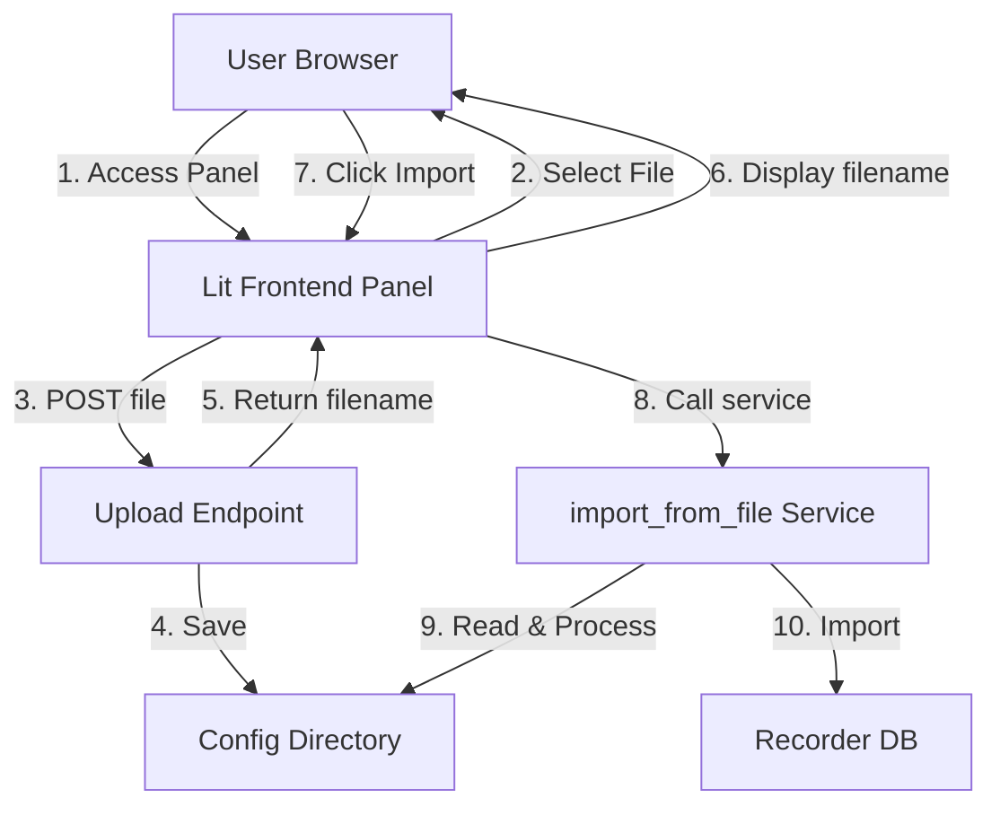

# File Upload Breakthrough Implementation - Technical Specification

**Version**: 2.0
**Status**: Ready for Implementation
**Target**: Minimal Custom Frontend Panel (Architecture Verification)
**Approach**: Lit Web Components + TypeScript (following final architecture)

## Executive Summary

This document specifies a **minimal breakthrough implementation** using the **Custom Frontend Panel** architecture to verify the approach works. This is a simplified version of the full architecture from [`file-upload-architecture.md`](file-upload-architecture.md), implementing only the core upload flow with fixed import parameters.

**Key Principle**: Use the final architecture (Lit panel) but with minimal features to prove the concept.

## Design Rationale

The breakthrough implementation uses the **same technology stack** as the final architecture:
- **Frontend**: TypeScript + Lit (Web Components)
- **Backend**: HTTP upload endpoint
- **Build**: Rollup bundler
- **Integration**: Home Assistant panel registration

This ensures we validate the architecture early, avoiding throwaway code.

## Architecture Overview



## Component Design

### 1. Backend Upload Endpoint

**File**: `custom_components/import_statistics/upload_view.py` (NEW)

**Purpose**: HTTP API endpoint for file uploads

**Class**: `ImportStatisticsUploadView`

**Endpoint**: `POST /api/import_statistics/upload`

**Authentication**: Home Assistant session auth + `@require_admin`

**Implementation**: Same as detailed in architecture plan

**Response Format**:
```json
{
  "success": true,
  "filename": "uploaded_statistics_20260201_181500.tsv",
  "size": 12345,
  "message": "File uploaded successfully"
}
```

### 2. Custom Frontend Panel (Minimal)

**Directory**: `custom_components/import_statistics/frontend/`

**Technology Stack**:
- **Lit 3.x** - Web Components framework
- **TypeScript** - Type safety
- **Rollup** - Bundler
- **Home Assistant Design System** - UI components

**Panel Structure** (Minimal):
```
frontend/
├── src/
│   ├── index.ts                    # Entry point, panel registration
│   ├── import-statistics-panel.ts  # Main panel component
│   └── types.ts                    # TypeScript type definitions
├── dist/                           # Build output (gitignored)
│   └── index.js                    # Bundled JavaScript
├── package.json                    # Dependencies
├── tsconfig.json                   # TypeScript config
└── rollup.config.js                # Build config
```

**Main Panel Component** (`import-statistics-panel.ts`):

```typescript
import { LitElement, html, css } from 'lit';
import { customElement, state } from 'lit/decorators.js';

@customElement('import-statistics-panel')
export class ImportStatisticsPanel extends LitElement {
  @state() private uploadedFilename = '';
  @state() private uploadStatus = '';
  @state() private importStatus = '';
  @state() private isUploading = false;
  @state() private isImporting = false;

  static styles = css`
    :host {
      display: block;
      padding: 16px;
    }
    .card {
      background: var(--card-background-color);
      border-radius: 8px;
      padding: 16px;
      margin-bottom: 16px;
    }
    .status {
      padding: 12px;
      border-radius: 4px;
      margin-top: 12px;
    }
    .status.success {
      background-color: var(--success-color);
      color: var(--text-primary-color);
    }
    .status.error {
      background-color: var(--error-color);
      color: var(--text-primary-color);
    }
  `;

  render() {
    return html`
      <div class="card">
        <h1>Import Statistics - Upload File</h1>

        <!-- Upload Section -->
        <div>
          <input
            type="file"
            accept=".csv,.tsv,.txt,.json"
            @change=${this.handleFileSelect}
            ?disabled=${this.isUploading}
          />
          <button
            @click=${this.handleUpload}
            ?disabled=${this.isUploading || !this.selectedFile}
          >
            ${this.isUploading ? 'Uploading...' : 'Upload File'}
          </button>
        </div>

        ${this.uploadStatus ? html`
          <div class="status ${this.uploadStatus.startsWith('✓') ? 'success' : 'error'}">
            ${this.uploadStatus}
          </div>
        ` : ''}
      </div>

      ${this.uploadedFilename ? html`
        <div class="card">
          <h2>Import Statistics</h2>
          <p>Uploaded file: <strong>${this.uploadedFilename}</strong></p>
          <p>Import settings (fixed for breakthrough):</p>
          <ul>
            <li>Delimiter: Tab (\\t)</li>
            <li>Decimal: Dot (.)</li>
            <li>Datetime format: %d.%m.%Y %H:%M</li>
            <li>Unit from entity: true</li>
          </ul>
          <button
            @click=${this.handleImport}
            ?disabled=${this.isImporting}
          >
            ${this.isImporting ? 'Importing...' : 'Import Statistics'}
          </button>

          ${this.importStatus ? html`
            <div class="status ${this.importStatus.startsWith('✓') ? 'success' : 'error'}">
              ${this.importStatus}
            </div>
          ` : ''}
        </div>
      ` : ''}
    `;
  }

  private selectedFile: File | null = null;

  private handleFileSelect(e: Event) {
    const input = e.target as HTMLInputElement;
    this.selectedFile = input.files?.[0] || null;
  }

  private async handleUpload() {
    if (!this.selectedFile) return;

    this.isUploading = true;
    this.uploadStatus = '';

    try {
      const formData = new FormData();
      formData.append('file', this.selectedFile);

      const response = await fetch('/api/import_statistics/upload', {
        method: 'POST',
        body: formData,
      });

      const result = await response.json();

      if (result.success) {
        this.uploadedFilename = result.filename;
        this.uploadStatus = `✓ File uploaded: ${result.filename}`;
      } else {
        this.uploadStatus = `✗ Upload failed: ${result.error}`;
      }
    } catch (error) {
      this.uploadStatus = `✗ Upload failed: ${error.message}`;
    } finally {
      this.isUploading = false;
    }
  }

  private async handleImport() {
    this.isImporting = true;
    this.importStatus = '';

    try {
      const response = await this.hass.callService(
        'import_statistics',
        'import_from_file',
        {
          filename: this.uploadedFilename,
          delimiter: '\\t',
          decimal: '.',
          datetime_format: '%d.%m.%Y %H:%M',
          unit_from_entity: true,
        }
      );

      this.importStatus = '✓ Import completed successfully';
    } catch (error) {
      this.importStatus = `✗ Import failed: ${error.message}`;
    } finally {
      this.isImporting = false;
    }
  }
}
```

**Entry Point** (`index.ts`):

```typescript
import './import-statistics-panel';

// Panel is registered via Python in __init__.py
```

### 3. Frontend Build Configuration

**package.json**:
```json
{
  "name": "import-statistics-panel",
  "version": "1.0.0",
  "scripts": {
    "build": "rollup -c",
    "dev": "rollup -c -w"
  },
  "dependencies": {
    "lit": "^3.0.0"
  },
  "devDependencies": {
    "@rollup/plugin-node-resolve": "^15.0.0",
    "@rollup/plugin-typescript": "^11.0.0",
    "rollup": "^4.0.0",
    "rollup-plugin-terser": "^7.0.0",
    "typescript": "^5.0.0"
  }
}
```

**rollup.config.js**:
```javascript
import resolve from '@rollup/plugin-node-resolve';
import typescript from '@rollup/plugin-typescript';
import { terser } from 'rollup-plugin-terser';

export default {
  input: 'src/index.ts',
  output: {
    file: 'dist/index.js',
    format: 'es',
    sourcemap: true,
  },
  plugins: [
    resolve(),
    typescript(),
    terser(),
  ],
};
```

**tsconfig.json**:
```json
{
  "compilerOptions": {
    "target": "ES2020",
    "module": "ESNext",
    "lib": ["ES2020", "DOM"],
    "declaration": true,
    "outDir": "./dist",
    "strict": true,
    "esModuleInterop": true,
    "skipLibCheck": true,
    "moduleResolution": "node",
    "experimentalDecorators": true
  },
  "include": ["src/**/*"],
  "exclude": ["node_modules", "dist"]
}
```

### 4. Panel Registration

**File**: `custom_components/import_statistics/__init__.py` (MODIFY)

**Changes**:

```python
from homeassistant.components.frontend import async_register_built_in_panel
from .upload_view import ImportStatisticsUploadView

async def async_setup_entry(hass: HomeAssistant, entry: ConfigEntry) -> bool:
    """Set up the device based on a config entry."""

    # Register upload endpoint
    hass.http.register_view(ImportStatisticsUploadView())

    # Register static files for panel
    await hass.http.async_register_static_paths([
        {
            "url_path": "/import_statistics_panel",
            "path": hass.config.path("custom_components/import_statistics/frontend/dist"),
        }
    ])

    # Register panel in sidebar
    hass.components.frontend.async_register_built_in_panel(
        component_name="custom",
        sidebar_title="Import Statistics",
        sidebar_icon="mdi:database-import-outline",
        frontend_url_path="import_statistics",
        config={
            "url_path": "/import_statistics_panel/index.html"
        },
        require_admin=True,
    )

    return True
```

### 5. Helper Functions

**File**: `custom_components/import_statistics/helpers.py` (MODIFY)

Add the same helper functions as in the original spec:
- `sanitize_upload_filename(original_name: str) -> str`
- `validate_upload_file(filename: str, size: int, content_type: str) -> None`

### 6. Constants

**File**: `custom_components/import_statistics/const.py` (MODIFY)

Add the same constants as in the original spec:
- `MAX_UPLOAD_SIZE_BYTES`
- `ALLOWED_UPLOAD_EXTENSIONS`
- `ALLOWED_MIME_TYPES`
- `UPLOAD_API_URL`

## File Storage Strategy

**Location**: Home Assistant config directory

**Naming**: `uploaded_{original_stem}_{timestamp}{ext}`

**Rationale**: Simple, no cleanup needed for breakthrough

## Implementation Checklist

### Files to Create

1. **Backend**:
   - `custom_components/import_statistics/upload_view.py` (~150 lines)

2. **Frontend**:
   - `custom_components/import_statistics/frontend/src/index.ts` (~5 lines)
   - `custom_components/import_statistics/frontend/src/import-statistics-panel.ts` (~150 lines)
   - `custom_components/import_statistics/frontend/src/types.ts` (~20 lines)
   - `custom_components/import_statistics/frontend/package.json` (~20 lines)
   - `custom_components/import_statistics/frontend/rollup.config.js` (~20 lines)
   - `custom_components/import_statistics/frontend/tsconfig.json` (~20 lines)
   - `custom_components/import_statistics/frontend/.gitignore` (ignore dist/, node_modules/)

3. **Testing**:
   - `tests/unit_tests/test_upload_helpers.py` (~150 lines)

### Files to Modify

1. `custom_components/import_statistics/const.py` (+15 lines)
2. `custom_components/import_statistics/helpers.py` (+60 lines)
3. `custom_components/import_statistics/__init__.py` (+25 lines)
4. `README.md` (+50 lines)
5. `CHANGELOG.md` (+5 lines)

### Build Process

**Setup** (one-time):
```bash
cd custom_components/import_statistics/frontend
npm install
```

**Development**:
```bash
npm run dev  # Watch mode
```

**Production**:
```bash
npm run build  # Creates dist/index.js
```

**Distribution**: Include `dist/index.js` in repository (pre-built for users)

## Step-by-Step Implementation Guide

### Phase 1: Backend Setup

1. Add constants to [`const.py`](custom_components/import_statistics/const.py)
2. Add helper functions to [`helpers.py`](custom_components/import_statistics/helpers.py)
3. Create [`upload_view.py`](custom_components/import_statistics/upload_view.py)
4. Test upload endpoint with curl

### Phase 2: Frontend Setup

1. Create `frontend/` directory structure
2. Add `package.json`, `tsconfig.json`, `rollup.config.js`
3. Run `npm install`
4. Create TypeScript panel component
5. Build with `npm run build`
6. Verify `dist/index.js` is created

### Phase 3: Panel Registration

1. Modify [`__init__.py`](custom_components/import_statistics/__init__.py) to register panel
2. Restart Home Assistant
3. Verify panel appears in sidebar
4. Test upload flow in browser

### Phase 4: Testing

1. Write unit tests for helper functions
2. Manual testing with various file types
3. Security testing (path traversal, oversized files)

### Phase 5: Documentation

1. Update README with panel access instructions
2. Add changelog entry
3. Document build process

## Success Criteria

✅ **Architecture Validation**:
- Lit panel renders correctly in Home Assistant
- TypeScript compiles without errors
- Rollup bundler produces working output
- Panel registration works
- Static file serving works

✅ **Core Functionality**:
- User can access panel from sidebar
- User can select and upload file
- File is saved to config directory
- User can import with fixed parameters
- Import succeeds with valid data

✅ **Security**:
- Only admin users can access panel
- File validation works
- Path traversal blocked

✅ **Build Process**:
- `npm install` works
- `npm run build` produces dist/index.js
- Pre-built dist/index.js works for end users

## Differences from Full Architecture

**Breakthrough Implementation** (Minimal):
- Single panel component (no tabs)
- Fixed import parameters (no configuration UI)
- No file preview
- No drag-and-drop
- No progress indicators
- No history tab
- Basic styling only

**Full Architecture** (Future):
- Tab-based interface (Import | Export | History)
- Configurable import settings
- File preview with validation
- Drag-and-drop upload
- Progress indicators
- Upload/export history
- Professional styling with HA design system

## Total Scope

- **Backend**: ~150 lines (1 new file)
- **Frontend**: ~215 lines (3 new TypeScript files)
- **Build Config**: ~60 lines (3 config files)
- **Helper Functions**: ~60 lines (modify helpers.py)
- **Constants**: ~15 lines (modify const.py)
- **Integration**: ~25 lines (modify __init__.py)
- **Tests**: ~150 lines (1 new test file)
- **Documentation**: ~55 lines (README, CHANGELOG)

**Total**: ~730 lines of code and configuration

## Dependencies

**New Dependencies** (frontend only):
- `lit` (^3.0.0) - Runtime dependency
- `typescript` (^5.0.0) - Dev dependency
- `rollup` (^4.0.0) - Dev dependency
- `@rollup/plugin-typescript` - Dev dependency
- `@rollup/plugin-node-resolve` - Dev dependency
- `rollup-plugin-terser` - Dev dependency

**Backend**: No new dependencies (uses Home Assistant core)

## Risks and Mitigations

### Risk: Frontend Build Complexity

**Mitigation**:
- Provide clear build documentation
- Include pre-built `dist/index.js` in repository
- Users don't need to build (only developers)
- Simple build process (just `npm install && npm run build`)

### Risk: Lit/TypeScript Learning Curve

**Mitigation**:
- Minimal TypeScript usage (simple component)
- Follow Home Assistant patterns
- Provide complete code templates
- Well-documented example

### Risk: Panel Registration Issues

**Mitigation**:
- Follow Home Assistant's panel registration API
- Test with real Home Assistant instance
- Clear error messages
- Fallback to simple HTML if needed

## Conclusion

This breakthrough implementation validates the **Custom Frontend Panel** architecture with minimal features:

✅ **Proves Architecture**: Uses Lit + TypeScript + Rollup (final stack)
✅ **Minimal Scope**: Only core upload flow, fixed parameters
✅ **Extensible**: Easy to add tabs, configuration, preview later
✅ **Production-Ready**: Same tech stack as final implementation

**Next Step**: Switch to Code mode to implement this specification

## Appendix: Complete File Listing

### New Files (10 total)

**Backend**:
1. `custom_components/import_statistics/upload_view.py`

**Frontend**:
2. `custom_components/import_statistics/frontend/src/index.ts`
3. `custom_components/import_statistics/frontend/src/import-statistics-panel.ts`
4. `custom_components/import_statistics/frontend/src/types.ts`
5. `custom_components/import_statistics/frontend/package.json`
6. `custom_components/import_statistics/frontend/rollup.config.js`
7. `custom_components/import_statistics/frontend/tsconfig.json`
8. `custom_components/import_statistics/frontend/.gitignore`

**Testing**:
9. `tests/unit_tests/test_upload_helpers.py`

**Build Output** (generated):
10. `custom_components/import_statistics/frontend/dist/index.js` (committed to repo)

### Modified Files (5 total)

1. `custom_components/import_statistics/const.py`
2. `custom_components/import_statistics/helpers.py`
3. `custom_components/import_statistics/__init__.py`
4. `README.md`
5. `CHANGELOG.md`
