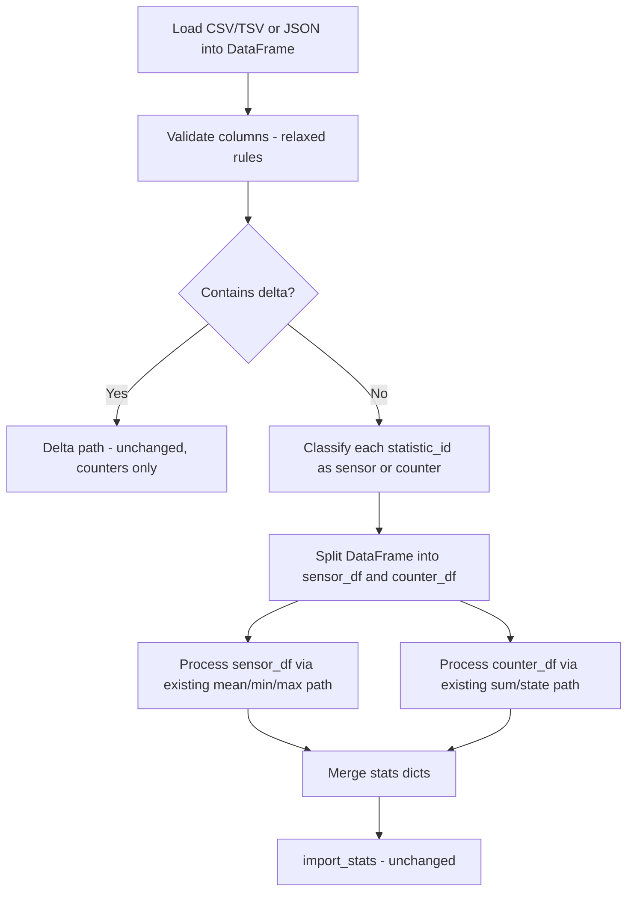

# Architecture: Mixed-Type Import (Sensors + Counters in One File)

## Problem Statement

Currently, the import pipeline rejects files that contain **both** measurement columns (`min`, `max`, `mean`) and counter columns (`sum`, `state`) simultaneously. This constraint is enforced in [`are_columns_valid()`](custom_components/import_statistics/helpers.py:123):

```python
elif has_mean_min_max and has_sum_state:
    handle_error("The file must not contain the columns 'sum/state' together with 'mean'/'min'/'max'")
```

However, the **export** pipeline already produces mixed files — both CSV/TSV and JSON — with sparse data where measurement rows have empty counter columns and vice versa. See [`export_mixed_data.tsv`](tests/testfiles/export_mixed_data.tsv) and [`config/test_all.csv`](config/test_all.csv).

**Goal**: Allow importing files that contain both measurement and counter statistics, enabling round-trip export→import without manual file splitting.

---

## Current Architecture Analysis

### Where the Mixing Ban is Enforced

The constraint lives in a single function but has downstream consequences:

1. **Column validation** — [`are_columns_valid()`](custom_components/import_statistics/helpers.py:86) rejects mixed columns at the structural level
2. **Processing assumes homogeneity** — [`handle_dataframe_no_delta()`](custom_components/import_statistics/import_service_helper.py:339) uses a single `has_mean` / `has_sum` flag for the entire DataFrame, then processes ALL rows through one code path
3. **Metadata is per-statistic but type flags are global** — The `metadata` dict built per `statistic_id` uses the global `has_mean` / `has_sum` to set `mean_type` and `has_sum` for ALL statistics identically

### What Already Works for Mixed Data

- **Export** already handles mixed data via [`prepare_export_data()`](custom_components/import_statistics/export_service_helper.py:81) and [`prepare_export_json()`](custom_components/import_statistics/export_service_helper.py:211)
- **Export** uses [`_detect_statistic_type()`](custom_components/import_statistics/export_service_helper.py:367) to classify per-entity
- **JSON import** already handles per-entity column differences naturally since each entity object has its own value keys
- **The `stats` dict** returned by processing is already keyed by `statistic_id` with per-entity metadata — the structure supports mixed types

### Delta Constraint

Delta columns remain incompatible with mixed data. The current rule — delta cannot coexist with sum/state/mean/min/max — should be preserved. Delta is a separate processing mode that converts to sum/state, so it is inherently counter-only.

---

## Proposed Architecture

### Core Idea: Split-then-Process

Instead of processing the entire DataFrame as one type, **split the DataFrame by detected type per `statistic_id`**, then process each sub-DataFrame through the existing homogeneous pipeline.



### Design Decisions

#### Decision 1: Per-Row Type Detection Strategy

**Approach**: Detect type per `statistic_id` group, not per row.

For each unique `statistic_id`, examine which value columns have non-empty data:
- If any row has non-NaN `mean`/`min`/`max` → classify as **sensor**
- If any row has non-NaN `sum`/`state` → classify as **counter**
- If a single `statistic_id` has BOTH → **error** (a single entity cannot be both)

This mirrors the export-side logic in [`_detect_statistic_type()`](custom_components/import_statistics/export_service_helper.py:367).

#### Decision 2: Column Validation Relaxation

Modify [`are_columns_valid()`](custom_components/import_statistics/helpers.py:86) to allow all value columns to coexist:

**Current allowed column sets** (mutually exclusive):
- `{statistic_id, start, unit, min, max, mean}` — sensors
- `{statistic_id, start, unit, sum, state}` — counters
- `{statistic_id, start, unit, delta}` — delta

**New allowed column set** (additive):
- `{statistic_id, start, unit, min, max, mean, sum, state}` — mixed
- `{statistic_id, start, unit, min, max, mean}` — sensors only (still valid)
- `{statistic_id, start, unit, sum, state}` — counters only (still valid)
- `{statistic_id, start, unit, delta}` — delta only (unchanged)

The key change: remove the error at line 123-124 that rejects mixed columns. The `delta` incompatibility rules remain unchanged.

#### Decision 3: Where to Split

Introduce a new function `split_dataframe_by_type()` that:
1. Groups by `statistic_id`
2. For each group, checks which columns have non-NaN values
3. Returns `(sensor_df, counter_df)` — two DataFrames with only the relevant columns

This function belongs in [`import_service_helper.py`](custom_components/import_statistics/import_service_helper.py) alongside the existing processing functions.

#### Decision 4: Reuse Existing Processing

[`handle_dataframe_no_delta()`](custom_components/import_statistics/import_service_helper.py:339) remains unchanged internally. Instead, a new orchestrator function calls it twice with the split DataFrames and merges results:

```python
def handle_dataframe_mixed(df: pd.DataFrame) -> dict:
    sensor_df, counter_df = split_dataframe_by_type(df)
    stats = {}
    if not sensor_df.empty:
        stats.update(handle_dataframe_no_delta(sensor_df))
    if not counter_df.empty:
        stats.update(handle_dataframe_no_delta(counter_df))
    return stats
```

This avoids modifying the well-tested existing processing logic.

---

## Detailed Changes by File

### [`helpers.py`](custom_components/import_statistics/helpers.py)

**[`are_columns_valid()`](custom_components/import_statistics/helpers.py:86)** — Relax the mixing constraint:

- Remove the error: `"The file must not contain the columns 'sum/state' together with 'mean'/'min'/'max'"`
- Keep the delta incompatibility rules unchanged
- Update the `allowed_columns` set for non-delta to include all value columns: `{statistic_id, start, unit, mean, min, max, sum, state}`
- This is already the case on line 127 — the allowed set already includes all of them. The only blocker is the explicit error on lines 123-124.

**Net change**: Remove 2 lines (the `elif` and `handle_error` on lines 123-124).

### [`import_service_helper.py`](custom_components/import_statistics/import_service_helper.py)

**New function: `split_dataframe_by_type()`**

```python
def split_dataframe_by_type(df: pd.DataFrame) -> tuple[pd.DataFrame, pd.DataFrame]:
    """Split a mixed DataFrame into sensor and counter sub-DataFrames."""
```

Logic:
1. For each `statistic_id`, check which value columns have any non-NaN values
2. Validate no `statistic_id` has both sensor AND counter data
3. Build two DataFrames:
   - `sensor_df`: rows for sensor entities, columns `[statistic_id, unit, start, min, max, mean]`
   - `counter_df`: rows for counter entities, columns `[statistic_id, unit, start, sum]` (+ `state` if present)
4. Drop the irrelevant columns from each sub-DataFrame to keep them clean for downstream processing

**New function: `handle_dataframe_mixed()`**

Orchestrates split + dual processing + merge. Called from [`_process_import()`](custom_components/import_statistics/import_service.py:208) when mixed data is detected.

**Modify [`_validate_and_detect_delta()`](custom_components/import_statistics/import_service_helper.py:27)** — Return richer type info:

Currently returns `bool` (is_delta). Change to return an enum or named type:

```python
class ImportDataType(Enum):
    SENSOR = "sensor"       # min/max/mean only
    COUNTER = "counter"     # sum/state only
    MIXED = "mixed"         # both sensor and counter entities
    DELTA = "delta"         # delta column present
```

### [`import_service.py`](custom_components/import_statistics/import_service.py)

**Modify [`_process_import()`](custom_components/import_statistics/import_service.py:208)** — Add mixed-data branch:

```python
async def _process_import(hass, data):
    if data.data_type == ImportDataType.DELTA:
        # existing delta path
    elif data.data_type == ImportDataType.MIXED:
        stats = await hass.async_add_executor_job(
            lambda: handle_dataframe_mixed(data.df)
        )
    else:
        # existing non-delta path (sensor-only or counter-only)
        stats = await hass.async_add_executor_job(
            lambda: handle_dataframe_no_delta(data.df)
        )
    await import_stats(hass, stats)
```

**Modify [`PreparedImportData`](custom_components/import_statistics/import_service.py:198)** — Replace `is_delta: bool` with `data_type: ImportDataType`.

### No Changes Required

- [`__init__.py`](custom_components/import_statistics/__init__.py) — Service registration unchanged
- [`import_service_delta_helper.py`](custom_components/import_statistics/import_service_delta_helper.py) — Delta processing unchanged
- [`delta_database_access.py`](custom_components/import_statistics/delta_database_access.py) — Database queries unchanged
- [`export_service.py`](custom_components/import_statistics/export_service.py) — Export unchanged
- [`export_service_helper.py`](custom_components/import_statistics/export_service_helper.py) — Export unchanged
- [`services.yaml`](custom_components/import_statistics/services.yaml) — No new service parameters needed

---

## Format-Specific Considerations

### CSV/TSV Mixed Format

The file has ALL columns in the header. Rows use empty cells for non-applicable columns:

```
statistic_id    unit    start              min    max    mean    sum    state
sensor.temp     °C      26.01.2024 12:00   20     21     20.5
counter.energy  kWh     26.01.2024 12:00                         10.5   100
```

This is exactly what the export already produces. Pandas reads empty cells as `NaN`, which the type detection logic uses to classify each `statistic_id`.

### JSON Mixed Format

JSON already supports mixed data naturally because each entity has its own value keys:

```json
[
    {
        "id": "sensor.temperature",
        "unit": "°C",
        "values": [
            {"datetime": "26.01.2024 12:00", "min": 20, "max": 21, "mean": 20.5}
        ]
    },
    {
        "id": "counter.energy",
        "unit": "kWh",
        "values": [
            {"datetime": "26.01.2024 12:00", "sum": 10.5, "state": 100}
        ]
    }
]
```

The existing [`prepare_json_data_to_import()`](custom_components/import_statistics/import_service_helper.py:181) already collects all unique columns across entities and builds a DataFrame with all of them. The only thing blocking it is the column validation in [`are_columns_valid()`](custom_components/import_statistics/helpers.py:86).

### Delta + Mixed: Explicitly Forbidden

A file cannot contain delta AND sensor data. Delta is inherently a counter concept. The existing validation in [`are_columns_valid()`](custom_components/import_statistics/helpers.py:118-121) already handles this and remains unchanged.

---

## Validation Pipeline Changes

### Current Pipeline

```
1. Load file → DataFrame
2. are_columns_valid() → REJECTS mixed columns ← THE BLOCKER
3. _validate_and_detect_delta() → returns is_delta bool
4. handle_dataframe_no_delta() or handle_dataframe_delta()
   → processes ALL rows as same type
5. import_stats() → sends to HA
```

### New Pipeline

```
1. Load file → DataFrame
2. are_columns_valid() → ALLOWS mixed columns (delta rules unchanged)
3. _validate_and_detect_delta() → returns ImportDataType enum
4. If MIXED:
   a. split_dataframe_by_type() → (sensor_df, counter_df)
      - Validates no statistic_id has both types
   b. handle_dataframe_no_delta(sensor_df) → sensor stats
   c. handle_dataframe_no_delta(counter_df) → counter stats
   d. Merge stats dicts
5. If SENSOR or COUNTER: handle_dataframe_no_delta() (unchanged)
6. If DELTA: handle_dataframe_delta() (unchanged)
7. import_stats() → sends to HA (unchanged)
```

---

## Edge Cases and Error Handling

### Single statistic_id with both sensor and counter data
**Error**: A `statistic_id` that has rows with `mean` values AND rows with `sum` values is invalid. This is caught during `split_dataframe_by_type()` with a clear error message:
> `"Statistic 'sensor.x' has both measurement (mean/min/max) and counter (sum/state) data. A single statistic cannot be both types."`

### All-empty value columns for a statistic_id
**Error**: If a `statistic_id` has no non-NaN values in any value column, raise an error during type detection.

### Sensor rows with partial mean/min/max
This is already handled by existing validation in [`validate_floats_vectorized()`](custom_components/import_statistics/helpers.py:427) — NaN values in required columns are caught.

### Counter rows without state column
Already supported — `state` is optional for counters. The existing code checks `"state" in columns`.

---

## Test Plan

### New Unit Tests

| Test | Description |
|------|-------------|
| `test_are_columns_valid_mixed` | Verify mixed columns are now accepted |
| `test_split_dataframe_by_type_basic` | Sensor + counter entities split correctly |
| `test_split_dataframe_by_type_single_entity_both_types` | Error when one entity has both |
| `test_split_dataframe_by_type_sensor_only` | Returns empty counter_df |
| `test_split_dataframe_by_type_counter_only` | Returns empty sensor_df |
| `test_handle_dataframe_mixed` | End-to-end mixed processing produces correct stats dict |
| `test_import_data_type_detection` | Verify ImportDataType enum is correctly detected |

### New Integration Tests (Mock)

| Test | Description |
|------|-------------|
| `test_import_mixed_csv` | Import a CSV with both sensor and counter rows |
| `test_import_mixed_json` | Import JSON with both sensor and counter entities |
| `test_import_mixed_roundtrip` | Export mixed → re-import produces same data |

### New Integration Test (Real HA, No Mocks)

Add `test_05_import_mixed_then_export_and_compare` to [`test_integration_delta_imports.py`](tests/integration_tests/test_integration_delta_imports.py).

This test runs **after** tests 01-04 (which populate the database with sensor and counter data), so it can leverage the existing HA instance and data.

**Test flow:**

1. **Create a mixed input file** — A pre-built TSV file at `config/test_mixed/mixed_input.tsv` combines sensor data (min/max/mean) and counter data (sum/state) in a single file with all columns. Uses **new entity IDs** (e.g. `sensor.mixed_test_temp`, `sensor.mixed_test_energy`) to avoid collisions with data from tests 01-04. Sensor rows have empty sum/state cells; counter rows have empty min/max/mean cells.

2. **Import the mixed file** — Call `import_from_file` with the mixed TSV. This exercises the new split-then-process pipeline.

3. **Export the imported entities** — Call `export_statistics` for the same entity IDs used in step 1, with the same time range.

4. **Compare export with expected reference** — Use the existing [`_compare_tsv_files_strict()`](tests/integration_tests/test_integration_delta_imports.py:258) or [`_compare_dataframes_strict()`](tests/integration_tests/test_integration_delta_imports.py:331) helper to verify the exported data matches the expected output. This proves the round-trip: mixed import → HA database → mixed export produces equivalent data.

**Test data files needed:**

| File | Description |
|------|-------------|
| `config/test_mixed/mixed_input.tsv` | Combined sensor + counter data with new entity IDs |
| `config/test_mixed/expected_after_import.tsv` | Expected export output |

**Key assertions:**
- The `import_from_file` service call succeeds (HTTP 200)
- The exported file contains both sensor columns (min/max/mean) and counter columns (sum/state)
- Sensor rows have correct min/max/mean values and empty sum/state
- Counter rows have correct sum/state values and empty min/max/mean
- Row counts match between input and output
- Numeric values match within tolerance (0.01)

**Also test JSON round-trip** — A second sub-step imports the same data via `import_from_json` with different entity IDs (e.g. `sensor:mixed_json_temp`, `sensor:mixed_json_energy`), exports to JSON, and compares. This verifies the JSON path handles mixed data correctly too.

### Existing Tests to Update

| Test File | Change |
|-----------|--------|
| [`test_are_columns_valid.py`](tests/unit_tests/test_are_columns_valid.py) | Update tests that expect mixed columns to be rejected → now accepted |
| [`test_handle_dataframe.py`](tests/unit_tests/test_handle_dataframe.py) | Add mixed-data test cases |

---

## Risk Assessment

### Low Risk
- Column validation change is a 2-line removal
- JSON import path needs minimal changes (already builds mixed DataFrames)
- Export is completely unaffected
- Delta path is completely unaffected

### Medium Risk
- `split_dataframe_by_type()` is new code that needs thorough testing
- The `ImportDataType` enum changes the return type of `_validate_and_detect_delta()`, requiring updates to all callers
- `PreparedImportData.is_delta` → `data_type` is a structural change touching multiple functions

### Mitigation
- The split-then-process approach reuses existing well-tested processing functions
- Type detection mirrors the proven export-side [`_detect_statistic_type()`](custom_components/import_statistics/export_service_helper.py:367)
- All existing tests continue to pass since sensor-only and counter-only files still work through the same paths
